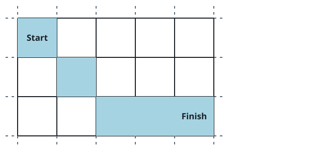

# On Time To The Target Cell

## Description

You are given integers `sx`, `sy`, `fx`, `fy`, and a non-negative integer
`t`.

The walk happens on an unbounded grid of cells. You begin in cell
`(sx, sy)` and, each second, must step onto one of its adjacent cells —
the 8 cells that share an edge or at least a corner with yours. Crossing
ground you have already visited is allowed.

Return `true` if some walk has you standing on cell `(fx, fy)` exactly at
second `t`, and `false` otherwise.

### Example 1


```text
Input: sx = 2, sy = 4, fx = 7, fy = 7, t = 6
Output: true
Explanation: Following the cells drawn in the picture, the walk from
(2, 4) stands on (7, 7) at the sixth second.
```

### Example 2



```text
Input: sx = 3, sy = 1, fx = 7, fy = 3, t = 3
Output: false
Explanation: As the picture shows, even the quickest walk from (3, 1)
only arrives on (7, 3) after 4 seconds, so the third second is out of
reach.
```

### Constraints

- `1 <= sx, sy, fx, fy <= 10⁹`
- `0 <= t <= 10⁹`

## Hints

### Hint 1

With these king-style moves the earliest possible arrival takes the
Chebyshev distance `max(|sx - fx|, |sy - fy|)` seconds; nothing gets
there sooner.

### Hint 2

When start and target differ, spare seconds cost nothing: a diagonal
step can be replaced by two orthogonal ones, and after arriving you can
step to a neighbor and back again. So `t` at least that distance means
`true`.

### Hint 3

The start-on-target case is the trap: `t = 0` succeeds at once, `t = 1`
never does because a move is forced every second, and from `t = 2` on an
out-and-back excursion succeeds.
