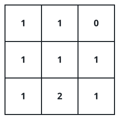
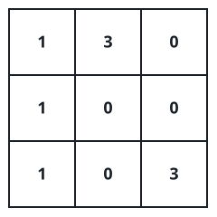

# Distributing Stones Across A Grid

## Description

You are given a 0-indexed 2D integer matrix `grid` of size 3 × 3, where
`grid[i][j]` counts the stones currently sitting in that cell. Several
stones may share a cell, and the grid holds exactly nine stones in all.

One move takes a single stone from the cell it occupies and sets it down
in a cell sharing a side with it.

Return the fewest moves that end with every cell holding exactly one
stone.

### Example 1



```text
Input: grid = [[1,1,0],[1,1,1],[1,2,1]]
Output: 3
Explanation: One way to reach one stone per cell, shown by the picture:
1- Take a stone from cell (2,1) and set it in cell (2,2).
2- Take a stone from cell (2,2) and set it in cell (1,2).
3- Take a stone from cell (1,2) and set it in cell (0,2).
Three moves suffice, and nothing cheaper does.
```

### Example 2



```text
Input: grid = [[1,3,0],[1,0,0],[1,0,3]]
Output: 4
Explanation: One way to reach one stone per cell, shown by the picture:
1- Take a stone from cell (0,1) and set it in cell (0,2).
2- Take a stone from cell (0,1) and set it in cell (1,1).
3- Take a stone from cell (2,2) and set it in cell (1,2).
4- Take a stone from cell (2,2) and set it in cell (2,1).
Four moves suffice, and nothing cheaper does.
```

### Constraints

- `grid.length == grid[i].length == 3`
- `0 <= grid[i][j] <= 9`
- `Sum of grid is equal to 9.`

## Hints

### Hint 1

At most four cells can ever hold more than one stone.

### Hint 2

Call `a` the number of cells holding two or more stones and `b` the
number of empty cells; `bᵃ ≤ 6561`, which is small enough to search
outright.

### Hint 3

Fill the empty cells one at a time, trying every cell that still has at
least two stones as the donor — a donated stone always comes from a cell
holding at least 2.
