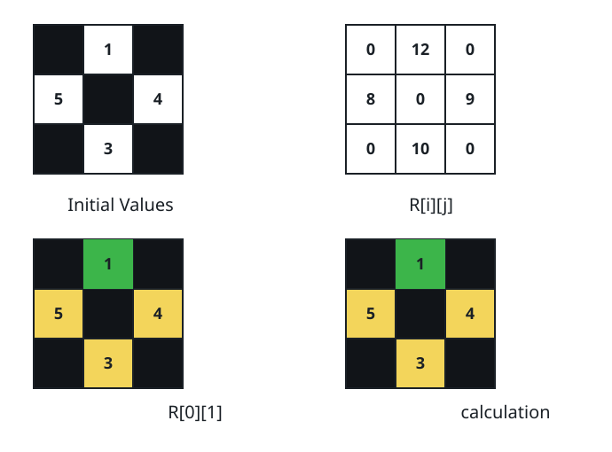
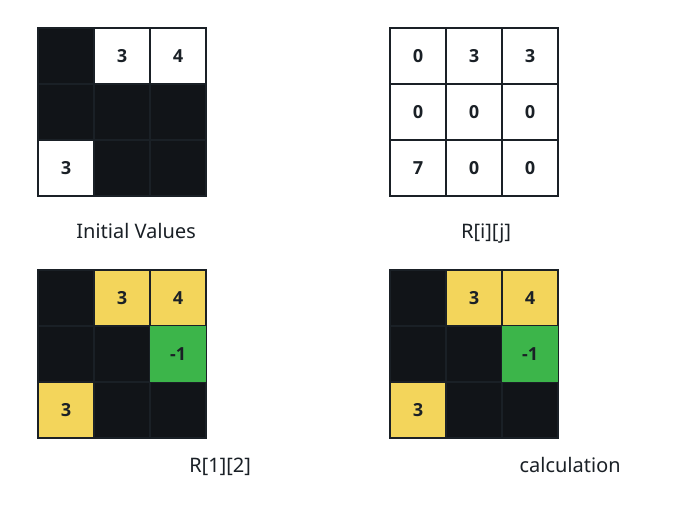

# Isolation Score Of The Grid

## Description

You are given a 0-indexed `n × n` matrix `grid`. Each cell holds either a
positive integer or `-1`, the mark of a blocked cell.

Movement runs along shared edges between unblocked cells only.

Because paths never cross a blocked cell, a cell may be cut off from
parts of the grid. Give each cell an isolation score:

- An unblocked cell scores the total of `grid[x][y]` over every unblocked
  cell that no path can reach from it.
- A blocked cell scores 0.

Return the sum of the scores of all cells.

### Example 1





```text
Input: grid = [[-1,1,-1],[5,-1,4],[-1,3,-1]]
Output: 39
Explanation: The figure's four panels tell the story. The top-left panel
shows the starting grid, blocked cells drawn black. The top-right panel
gives every cell's score; they add up to 0 + 12 + 0 + 8 + 0 + 9 + 0 +
10 + 0 = 39. The bottom-left panel zooms in on cell (0, 1), drawn green:
the yellow cells are exactly the ones no walk from (0, 1) can reach, and
they total 5 + 4 + 3 = 12. The bottom-right panel does the same for cell
(1, 2), whose unreachable cells total 1 + 5 + 3 = 9.
```

### Example 2

```text
Input: grid = [[2,4,-1],[-1,-1,3]]
Output: 12
Explanation: Two unblocked regions exist: the pair 2 and 4, and the lone
3. A cell of the pair reaches only its partner, so each scores 3; the
lone 3 scores 2 + 4 = 6; the blocked cells score 0. The sum is
3 + 3 + 0 + 0 + 0 + 6 = 12.
```

### Example 3

```text
Input: grid = [[7]]
Output: 0
Explanation: With no other cell on the board, the single cell is cut off
from nothing and scores 0.
```

### Constraints

- `1 <= n <= 300`
- `1 <= grid[i][j] <= 10⁶` or `grid[i][j] == -1`

## Hints

### Hint 1

Read the grid as a graph: a node per cell, and an edge joins two nodes
whose cells are both unblocked and share an edge.

### Hint 2

Split that graph into connected components.

### Hint 3

Every cell of one component carries the same score — the sum of all
values outside it — so each component contributes its size times the
value held by the other components.
