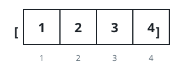
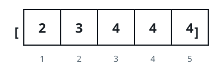

# How Small Can The Array Get

## Description

You are given an array `nums` of integers, arranged in non-decreasing
order.

One move works like this: pick two positions `i` and `j` whose values
differ — specifically `nums[i] < nums[j]` — and delete both entries.
Everything that remains keeps its relative order and is renumbered from
zero.

You may make as many moves as you like, or none at all. Report the
shortest length `nums` can reach.

### Example 1



```text
Input: nums = [1,2,3,4]
Output: 0
```

### Example 2


```text
Input: nums = [1,1,2,2,3,3]
Output: 0
```

### Example 3

```text
Input: nums = [7,7,7,7,8]
Output: 3
Explanation: One move can delete a 7 together with the 8, but no two
of the remaining 7s differ, so three entries are stuck.
```

### Example 4



```text
Input: nums = [2,3,4,4,4]
Output: 1
```

### Constraints

- `1 <= nums.length <= 10⁵`
- `1 <= nums[i] <= 10⁹`
- `nums` is sorted in non-decreasing order.

## Hints

### Hint 1

Fewer leftover elements means more moves were made, so the task is
really about squeezing out as many legal moves as possible.

### Hint 2

If `k` moves are achievable, a good way to spend them is on the `k`
smallest entries and the `k` largest entries of `nums`.

### Hint 3

Given those two halves, how should the individual values be matched up
so that every pair really consists of two different numbers?

### Hint 4

Line the `k` smallest values up as a sorted array `a` and the `k`
largest as a sorted array `b`, both 0-indexed. Matching `a[i]` with
`b[i]` turns out to be best, so `k` works exactly when
`a[i] < b[i]` holds for every `i` from `0` to `k - 1`.

### Hint 5

That validity is monotone in `k`, which invites a binary search for the
largest `k` that passes.

### Hint 6

Whatever survives is `nums.length - 2 * k` long.
