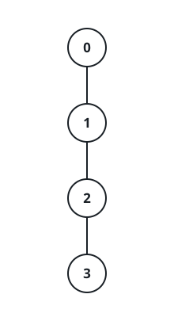
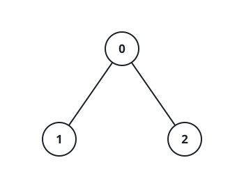

# The Best Harvest From A Coin Tree

## Description

A tree is rooted at node 0 and has `n` nodes numbered `0` through
`n - 1`. The tree arrives as `edges`, an array of `n - 1` pairs where
`edges[i] = [ai, bi]` joins nodes `ai` and `bi`. You are also given an
array `coins` of length `n`, where `coins[i]` counts the coins sitting
on node `i`, and an integer `k`.

You harvest the whole tree starting from the root, and a node's coins
only become available once every one of its ancestors has been
harvested. Harvesting node `i` means picking exactly one of two moves:

- Pocket the whole pile for `coins[i] - k` points; when `coins[i] - k`
  is negative you absorb a loss of `abs(coins[i] - k)` points instead.
- Pocket half the pile for `floor(coins[i] / 2)` points, and halve
  every coin count in node `i`'s subtree — each `coins[j]` beneath it
  becomes `floor(coins[j] / 2)`.

Return the largest total score you can bank after harvesting every node
of the tree.

### Example 1



```text
Input: edges = [[0,1],[1,2],[2,3]], coins = [10,10,3,3], k = 5
Output: 11
Explanation: Work down the chain. Node 0 pockets its full 10 coins and
pays k, scoring 10 - 5 = 5; node 1 does the same, bringing the total
to 10.
At node 2 switch to the halving move: the 3 coins score
floor(3 / 2) = 1, and node 3's pile shrinks to floor(3 / 2) = 1, so the
total reaches 11.
Node 3 is harvested with the halving move too, adding floor(1 / 2) = 0.
No harvesting plan earns more than 11.
```

### Example 2



```text
Input: edges = [[0,1],[0,2]], coins = [8,4,4], k = 0
Output: 16
Explanation: With k = 0 the whole-pile move gives nothing away, so
harvest every node the plain way: (8 - 0) + (4 - 0) + (4 - 0) = 16
points.
```

### Constraints

- `n == coins.length`
- `2 <= n <= 10⁵`
- `0 <= coins[i] <= 10⁴`
- `edges.length == n - 1`
- `0 <= edges[i][0], edges[i][1] < n`
- `0 <= k <= 10⁴`

## Hints

### Hint 1

Treat the harvest as one independent choice per node: a node's payoff
depends only on its own coins, the move it picks, and how many halving
moves were already made among its ancestors.

### Hint 2

A coin count is at most `10⁴ < 2¹⁴`, so after a node has been halved 14
times its pile is 0 forever — tracking more than fifteen halving states
per node is pointless.

### Hint 3

Let `dp[x][t]` be the best score obtainable from the subtree rooted at
`x` when `t` ancestors of `x` took the halving move; node `x`'s coins
are then exactly `coins[x] >> t`.

### Hint 4

`dp[x][t] = max((coins[x] >> t) - k + Σ dp[y][t], (coins[x] >>
(t + 1)) + Σ dp[y][t + 1])`, summing over the direct children `y` — the
first branch is the whole-pile move (its `k` cost may make it negative)
and the second is the halving move. The answer is `dp[0][0]`.
