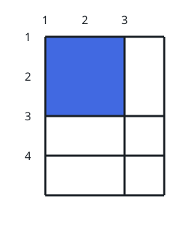
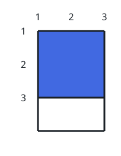
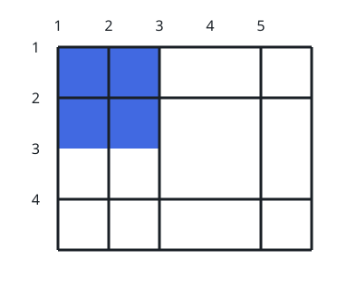

# The Biggest Square Gap

## Description

You are given two integers `n` and `m` together with two index arrays,
`hBars` and `vBars`. Bars numbered from 1 — `n + 2` horizontal ones and
`m + 2` vertical ones — frame a field of `1 x 1` unit cells.

You may take away any subset of the horizontal bars named in `hBars` and
any subset of the vertical bars named in `vBars`. Every bar outside those
two lists is riveted in place and cannot move.

Return the largest area of a square-shaped hole that can be opened this
way, after removing some bars — possibly none at all.

### Example 1



```text
Input: n = 2, m = 1, hBars = [2,3], vBars = [2]
Output: 4
Explanation: The figure pairs the starting lattice with a possible
finish. Horizontal bars [1,2,3,4] and vertical bars [1,2,3] frame the
grid at first; dropping horizontal bar 2 and vertical bar 2 opens a
2 x 2 square, area 4.
```

### Example 2



```text
Input: n = 1, m = 1, hBars = [2], vBars = [2]
Output: 4
Explanation: Taking out horizontal bar 2 and vertical bar 2 opens a
2 x 2 square, and nothing larger is reachable.
```

### Example 3



```text
Input: n = 2, m = 3, hBars = [2,3], vBars = [2,4]
Output: 4
Explanation: One winning move removes horizontal bar 3 and vertical
bar 4, which leaves an opening two cells tall and two cells wide.
```

### Constraints

- `1 <= n <= 10⁹`
- `1 <= m <= 10⁹`
- `1 <= hBars.length <= 100`
- `2 <= hBars[i] <= n + 1`
- `1 <= vBars.length <= 100`
- `2 <= vBars[i] <= m + 1`
- All values in hBars are distinct.
- All values in vBars are distinct.

## Hints

### Hint 1

Handle the two axes on their own, after putting each bar list in order.

### Hint 2

On each axis, look for the longest stretch of consecutive integer bar
indices — call the winner `[hx, hy]` horizontally and `[vx, vy]`
vertically.

### Hint 3

The widest square span available is `min(hy - hx + 2, vy - vx + 2)`.

### Hint 4

The answer is that span multiplied by itself.
