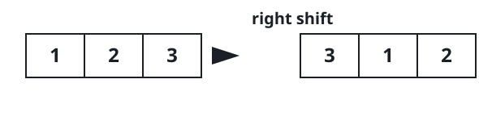
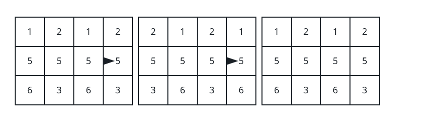

# A Matrix Untouched By The Shifts

## Description

You are given an `m x n` integer matrix `mat` and an integer `k`. Rows are
numbered from 0.

One step of the process nudges every row around a ring:

- Rows at even indices (0, 2, 4, ...) slide one position to the left, and
  the first entry wraps around to the end.
- Rows at odd indices (1, 3, 5, ...) slide one position to the right, and
  the last entry wraps around to the front.




The step runs `k` times in total. Report whether the matrix that comes out
at the end is exactly the matrix that went in.

### Example 1


```text
Input: mat = [[1,2,3],[4,5,6],[7,8,9]], k = 4
Output: false
Explanation: Every step slides rows 0 and 2 (even indices) leftward and
row 1 (odd index) rightward, and the entries never line back up with
where they started.
```

### Example 2



```text
Input: mat = [[1,2,1,2],[5,5,5,5],[6,3,6,3]], k = 2
Output: true
```

### Example 3

```text
Input: mat = [[1,2],[3,4]], k = 1
Output: false
Explanation: One step turns row 0 into [2,1] and row 1 into [4,3],
leaving [[2,1],[4,3]] — no longer the matrix it was.
```

### Constraints

- `1 <= mat.length <= 25`
- `1 <= mat[i].length <= 25`
- `1 <= mat[i][j] <= 25`
- `1 <= k <= 50`

## Hints

### Hint 1

Only `k % n` shifts matter — after `n` of them every row has come full
circle and the matrix is back where it began.
