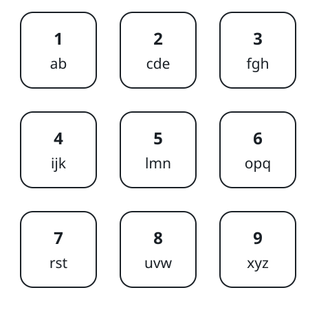

# Tallying Divisible Substrings

## Description

Each letter of the English alphabet has been assigned a digit value,
arranged in the grid below.



A string of letters is divisible when the total of its characters' digit
values splits evenly over the string's length.

Given a string word, count its substrings that are divisible. A substring
is a contiguous, non-empty run of characters within word.

### Example 1

```text
Substring  Mapped      Sum  Length  Divisible?
n          5             5       1  Yes
no         5, 6         11       2  No
noo        5, 6, 6      17       3  No
noon       5, 6, 6, 5   22       4  No
o          6             6       1  Yes
oo         6, 6         12       2  Yes
oon        6, 6, 5      17       3  No
o          6             6       1  Yes
on         6, 5         11       2  No
n          5             5       1  Yes

Input: word = "noon"
Output: 5
Explanation: The table walks through every substring of word, and
exactly 5 of them pass the divisibility test.
```

### Example 2

```text
Input: word = "meme"
Output: 6
Explanation: The survivors are "m", "mem" (5 + 2 + 5 = 12 over length
3), "e", "eme" (2 + 5 + 2 = 9 over length 3), "m", and "e". Every single
letter divides by 1 automatically.
```

### Example 3

```text
Input: word = "hotdog"
Output: 9
Explanation: Beyond the six single letters, the longer winners are "do"
(2 + 6 = 8 over length 2), "otd" (6 + 7 + 2 = 15 over length 3), and
"tdo" (7 + 2 + 6 = 15 over length 3).
```

### Constraints

- `1 <= word.length <= 2000`
- `word` consists only of lowercase English letters.

## Hints

### Hint 1

There are only O(n²) substrings, so checking each one directly fits the
budget.

### Hint 2

Keep running totals of the mapped digit values so that any substring's
sum costs one subtraction.

### Hint 3

One modulo against the substring's length then settles each candidate.
