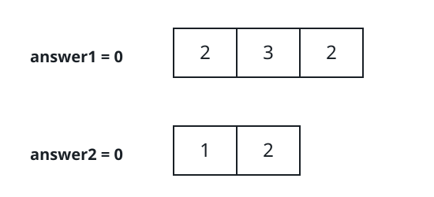

# Cross-Array Presence Counts

## Description

You are given two integer arrays, `nums1` of length `n` and `nums2` of
length `m`. Judge each array against the other by pure presence —
position and repetition inside its own array do not matter. Two counts
capture this:

- `answer1`: the number of positions `i` whose value `nums1[i]` also
  occurs somewhere in `nums2`;
- `answer2`: the number of positions `i` whose value `nums2[i]` also
  occurs somewhere in `nums1`.

Return `[answer1, answer2]`.

### Example 1



```text
Input: nums1 = [2,3,2], nums2 = [1,2]
Output: [2,1]
```

### Example 2

```text
Input: nums1 = [7,4,7,9], nums2 = [9,5,4]
Output: [2,2]
Explanation: In `nums1` the values 4 and 9 are present in `nums2`, so
`answer1` counts their two positions. In `nums2` the values 9 and 4 are
present in `nums1`, so `answer2` is also 2.
```

### Example 3

```text
Input: nums1 = [6,8], nums2 = [3,10,3]
Output: [0,0]
Explanation: The two arrays share no value at all, so both counts are
zero.
```

### Constraints

- `n == nums1.length`
- `m == nums2.length`
- `1 <= n, m <= 100`
- `1 <= nums1[i], nums2[i] <= 100`

## Hints

### Hint 1

The limits are tiny — even checking every pair of values head-on
finishes immediately.

### Hint 2

Faster and cleaner: build the set of distinct values of one array, then
each position of the other array contributes one count exactly when its
value lands in that set.
