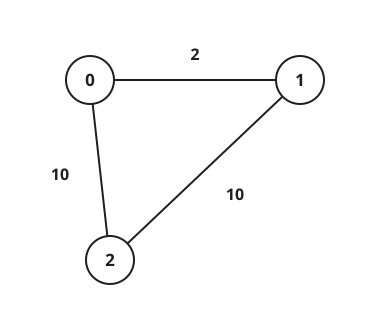
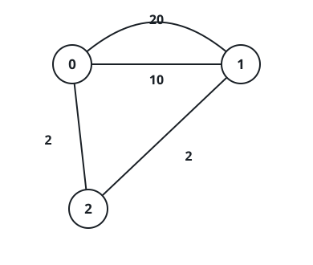

# Counting Branch-Closure Plans

## Description

A company runs `n` branches around the country, some pairs of which are
joined by roads. To begin with, every branch can reach every other
branch along the network.

Hoping to cut travel time, the company picks a set of branches to shut
down — possibly none, possibly all of them. A closure plan is
acceptable when the branches left open all sit within `maxDistance` of
each other, where the distance between two branches is the least total
road length that connects them. Shutting a branch down removes its
roads from the network as well.

You are given the integers `n` and `maxDistance` together with a
0-indexed array `roads`, where `roads[i] = [uᵢ, vᵢ, wᵢ]` describes an
undirected road of length `wᵢ` between branches `uᵢ` and `vᵢ`. Count
the acceptable closure plans. Two roads may connect the same pair of
branches.

### Example 1



```text
Input: n = 3, maxDistance = 5, roads = [[0,1,2],[1,2,10],[0,2,10]]
Output: 5
Explanation: Closing only branch 2 works — branches 0 and 1 stay 2
apart. Closing nothing fails, since branches 1 and 2 sit 10 apart, and
so does closing only branch 0 or only branch 1. Every plan that closes
two or three branches leaves at most one branch active and passes.
That makes five acceptable plans.
```

### Example 2



```text
Input: n = 3, maxDistance = 5, roads = [[0,1,20],[0,1,10],[1,2,2],[0,2,2]]
Output: 7
Explanation: Exactly one plan fails: closing branch 2 alone, which
leaves branches 0 and 1 joined only by roads of length 20 and 10.
Keeping all three branches open passes because branch 2 relays the
0-to-1 trip for 2 + 2 = 4, and any plan that closes two or three
branches trivially fits the bound. Seven plans work in total.
```

### Example 3

```text
Input: n = 2, maxDistance = 3, roads = [[0,1,4]]
Output: 3
Explanation: Keeping both branches open fails — their only road runs
length 4, beyond the cap of 3. The three plans that close branch 0,
close branch 1, or close both each leave at most one branch active and
so pass.
```

### Constraints

- `1 <= n <= 10`
- `1 <= maxDistance <= 10⁵`
- `0 <= roads.length <= 1000`
- `roads[i].length == 3`
- `0 <= uᵢ, vᵢ <= n - 1`
- `uᵢ != vᵢ`
- `1 <= wᵢ <= 1000`
- The initial road network already connects every branch to every
  other.

## Hints

### Hint 1

With `n <= 10`, at most `2¹⁰` closure plans exist — each one can be
tried outright.

### Hint 2

For a fixed plan, all-pairs shortest paths over the surviving branches
(Floyd-Warshall) decides acceptance; seed the distance matrix with the
cheapest road seen per pair.
