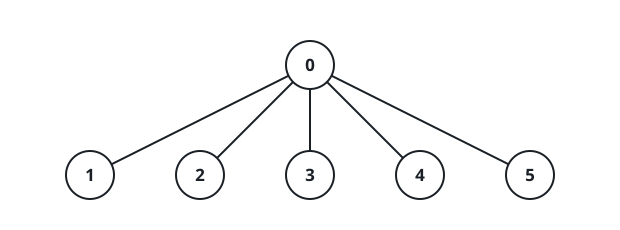
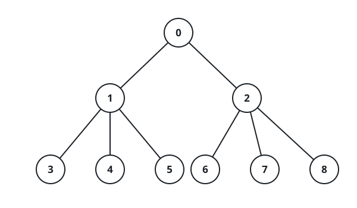

# A Coin Pile for Every Subtree

## Description

An undirected tree has `n` nodes numbered `0` through `n - 1` and is
rooted at node `0`. It arrives as a 2D array `edges` of length `n - 1`,
where `edges[i] = [ai, bi]` joins nodes `ai` and `bi`. Alongside it, a
0-indexed array `cost` of length `n` hands each node a value — `cost[i]`
belongs to node `i` and may be negative.

Every node ends up holding a pile of coins, sized by these rules:

- If node `i`'s subtree contains fewer than 3 nodes, the pile is
  exactly 1 coin.
- Otherwise the pile equals the largest product of `cost` values over
  any 3 distinct nodes inside that subtree — and when that best product
  is negative, the pile is 0 instead.

Return an array `coin` of length `n` where `coin[i]` holds the size of
node `i`'s pile.

### Example 1



```text
Input: edges = [[0,1],[0,2],[0,3],[0,4],[0,5]], cost = [1,2,3,4,5,6]
Output: [120,1,1,1,1,1]
Explanation: Node 0's subtree spans the whole tree, and its three
richest values are 6, 5, and 4, giving 6 * 5 * 4 = 120 coins. Every
other node is a leaf — its subtree has size 1 — so each places the
default single coin.
```

### Example 2



```text
Input: edges = [[0,1],[0,2],[1,3],[1,4],[1,5],[2,6],[2,7],[2,8]], cost =
[1,4,2,3,5,7,8,-4,2]
Output: [280,140,32,1,1,1,1,1,1]
Explanation: Working out the piles:
- Node 0 sees the entire tree and takes 8 * 7 * 5 = 280 coins.
- Node 1's subtree carries values 4, 3, 5, 7, so it takes
  7 * 5 * 4 = 140 coins.
- Node 2's subtree carries 2, 8, -4, 2; the winning triple there is
  8 * 2 * 2 = 32, since any triple using -4 turns negative.
- The six remaining nodes are leaves, so each places 1 coin.
```

### Example 3


```text
Input: edges = [[0,1],[0,2]], cost = [1,2,-2]
Output: [0,1,1]
Explanation: Nodes 1 and 2 are leaves and place 1 coin each. The only
triple available to node 0 multiplies out to 2 * 1 * -2 = -4, which is
negative, so node 0 places 0 coins.
```

### Constraints

- `2 <= n <= 2 * 10⁴`
- `edges.length == n - 1`
- `edges[i].length == 2`
- `0 <= ai, bi < n`
- `cost.length == n`
- `1 <= |cost[i]| <= 10⁴`
- The given `edges` are guaranteed to form a valid tree.

## Hints

### Hint 1

Walk the tree once. For every subtree, remember its three largest cost
values and its two smallest — two size-3 heaps, or short sorted lists,
will do.

### Hint 2

At most six stored values per subtree are ever needed.

### Hint 3

Given those values, the best product of three is either the three
largest multiplied together or the two smallest multiplied by the
largest; clamp a negative result to 0.

### Hint 4

A subtree holding fewer than three values reports 1 instead.
