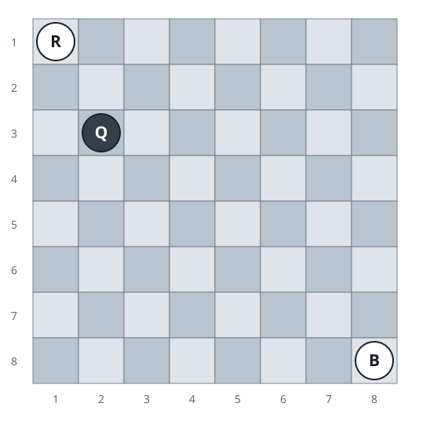
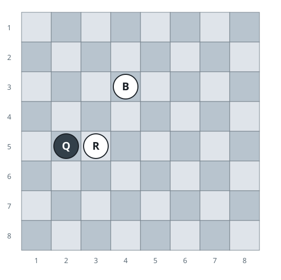

# Catching The Queen

## Description

An `8 x 8` chessboard numbers its rows and columns from `1` to `8`, so every
square is a `(row, column)` pair. Three pieces stand on the board:

- `(a, b)` is the white rook.
- `(c, d)` is the white bishop.
- `(e, f)` is the black queen.

Only the white side ever moves, and it keeps moving until the queen falls.
Return the fewest white moves needed for either white piece to capture the
black queen.

The movement rules:

- A rook slides any distance along a single row or a single column.
- A bishop slides any distance along a single diagonal.
- No piece may jump over another piece; with only three pieces on the board,
  the sole possible blocker between a white piece and the queen is the other
  white piece.
- A white piece captures the queen by landing exactly on her square, which
  it may do whenever that square is reachable under its movement rule.
- The queen never moves.

### Example 1



```text
Input: a = 1, b = 1, c = 8, d = 8, e = 2, f = 3
Output: 2
Explanation: Neither white piece attacks the queen yet, so one move cannot
be enough. Slide the rook from (1, 1) along its row to (1, 3), then one
square along that column onto the queen at (2, 3) — captured on move two.
```

### Example 2



```text
Input: a = 5, b = 3, c = 3, d = 4, e = 5, f = 2
Output: 1
Explanation: Both white pieces already attack the queen in a single move:
the rook shares her row with nothing in between, and the bishop reaches her
square along an unobstructed diagonal.
```

### Constraints

- `1 <= a, b, c, d, e, f <= 8`
- The three pieces occupy three distinct squares.

## Hints

### Hint 1

A capture is always possible within two white moves, and never needs more,
so only two answers exist.

### Hint 2

The answer is `1` exactly when the rook or the bishop already attacks the
queen with the other white piece not standing anywhere along that attack
line.
