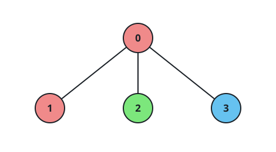
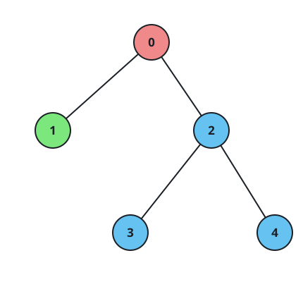

# The Largest Monochrome Subtree

## Description

You are given a 2D integer array `edges` describing a tree of `n` nodes,
numbered `0` through `n - 1` and rooted at node `0`; each `edges[i] = [ui, vi]`
connects nodes `ui` and `vi`. You are also given a 0-indexed array `colors`
of length `n`, where `colors[i]` is the color of node `i`.



Pick a node `v` whose subtree is monochrome — every node inside it carries
the same color as `v` itself — and do so so that the subtree holds as many
nodes as possible. Return that node count.

### Example 1

```text
Input: edges = [[0,1],[0,2],[0,3]], colors = [1,1,2,3]
Output: 1
Explanation: Reading the colors as 1 → red, 2 → green, 3 → blue, the root's
subtree mixes three colors. Every other node sits in a subtree of its own
single color, and each such subtree holds just one node — so 1 is the best
on offer.
```

### Example 2



```text
Input: edges = [[0,1],[0,2],[0,3]], colors = [1,1,1,1]
Output: 4
Explanation: All four nodes share one color, so the entire tree is one
monochrome subtree of size 4.
```

### Example 3

```text
Input: edges = [[0,1],[0,2],[2,3],[3,4]], colors = [6,1,6,6,6]
Output: 3
Explanation: Node `1`'s stray color poisons the root's subtree, but the
branch hanging off node `2` is one unbroken run of color `6` — the subtree
rooted at node `2` spans `{2, 3, 4}` and is the largest monochrome subtree.
```

### Constraints

- `n == edges.length + 1`
- `1 <= n <= 5 × 10⁴`
- `edges[i] == [ui, vi]` with `0 <= ui, vi < n`
- `colors.length == n`
- `1 <= colors[i] <= 10⁵`
- The edges are guaranteed to form a tree.

## Hints

### Hint 1

Give every node a flag that says whether its subtree is monochrome so far.

### Hint 2

Process children before parents: once the walk of a child `u` (called from
`v`) has settled, a non-monochrome `u` makes `v` non-monochrome as well.

### Hint 3

Even a clean child breaks the parent's run when `color[u] != color[v]`;
otherwise the child's whole count merges into the parent's.
