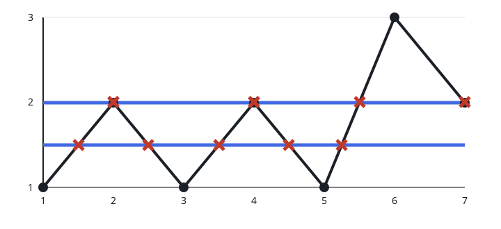
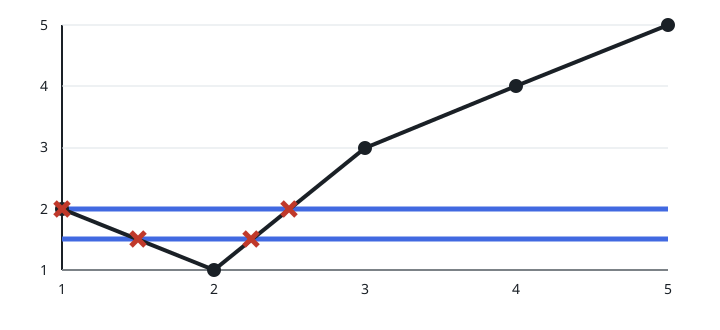

# Most Crossings On A Line Chart

## Description

A line chart is drawn from `n` points joined in order by straight segments.
The points are numbered from 1, and the k-th point sits at coordinates
`(k, y[k])`, where `y` is a 1-indexed integer array. Consecutive points
never share a height, so the chart contains no horizontal pieces.

Now imagine drawing one infinitely long horizontal line anywhere on the
chart. Its position is yours to choose. Report the largest number of points
at which such a line can cross the chart.

### Example 1



```text
Input: y = [1,2,1,2,1,3,2]
Output: 5
Explanation: In the picture, the line y = 1.5 meets the chart at 5 points
(marked with red crosses), while the line y = 2 manages only 4. No
placement beats 5, so the answer is 5.
```

### Example 2



```text
Input: y = [2,1,3,4,5]
Output: 2
Explanation: In the picture, the line y = 1.5 crosses the chart twice, and
so does the line y = 2. Every placement yields at most 2 crossings, so the
answer is 2.
```

### Constraints

- `2 <= y.length <= 10⁵`
- `1 <= y[i] <= 10⁹`
- adjacent heights always differ: `y[i] != y[i + 1]` for every neighboring
  pair

## Hints

### Hint 1

Think of sliding a horizontal ruler upward from beneath the chart.

### Hint 2

Between two consecutive point heights nothing changes, so the count only
has to be re-read when the ruler reaches one of the values in `y`.

### Hint 3

Reaching a point that sits below one of its neighbors lifts the count.

### Hint 4

Reaching a point that sits above one of its neighbors lowers the count.

### Hint 5

A Fenwick tree offers another way to organize the same counting.
