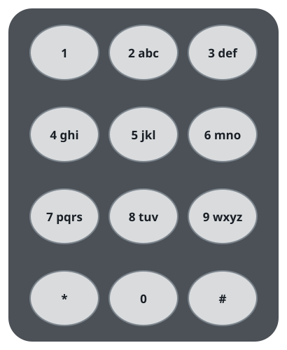
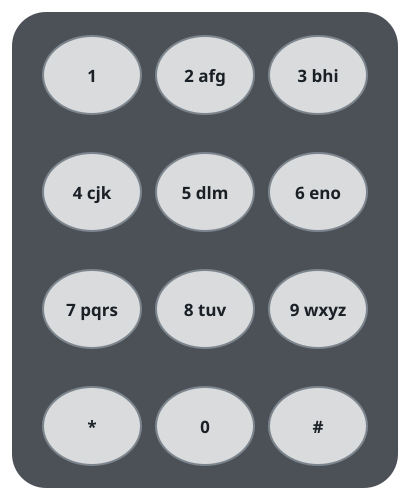
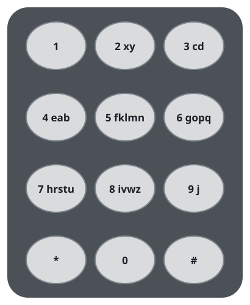

# Fewest Taps To Type A Word I

## Description

You are given a string `word` made up of distinct lowercase English
letters.

On a telephone keypad, every key holds some collection of letters, and
typing a letter means tapping its key: if key 2 is assigned
`["a","b","c"]`, then typing "a" takes one tap, "b" two taps, and "c"
three taps.

The keys numbered 2 through 9 may each be reassigned any collection of
letters. A letter may only ever belong to one key, and no two keys may
share a letter. Work out the smallest number of key taps that can spell
`word` under the best possible assignment, and return that number.

The standard keypad layout, where `1`, `*`, `#`, and `0` carry no letters,
is shown below.



### Example 1



```text
Input: word = "abcde"
Output: 5
Explanation: The assignment pictured above is optimal. Each letter sits
in the first position of its own key:
"a" -> one tap on key 2
"b" -> one tap on key 3
"c" -> one tap on key 4
"d" -> one tap on key 5
"e" -> one tap on key 6
for a total of 1 + 1 + 1 + 1 + 1 = 5. No assignment can spell the word in
fewer taps.
```

### Example 2



```text
Input: word = "xycdefghij"
Output: 12
Explanation: The assignment pictured above is optimal. Ten letters must
share the eight keys, so two keys take a second letter:
"x" -> one tap on key 2
"y" -> two taps on key 2
"c" -> one tap on key 3
"d" -> two taps on key 3
"e" -> one tap on key 4
"f" -> one tap on key 5
"g" -> one tap on key 6
"h" -> one tap on key 7
"i" -> one tap on key 8
"j" -> one tap on key 9
for a total of 1 + 2 + 1 + 2 + 1 + 1 + 1 + 1 + 1 + 1 = 12, which is the
best possible.
```

### Constraints

- `1 <= word.length <= 26`
- `word` consists of lowercase English letters.
- All letters in `word` are distinct.

## Hints

### Hint 1

Eight keys are available: eight letters can be reached in one tap each,
eight more in two taps each, and so on.

### Hint 2

Distributing the letters evenly across the keys achieves that minimum.
