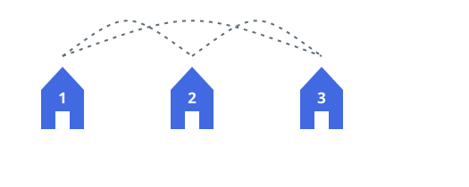
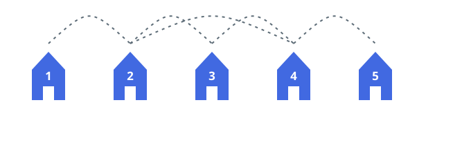
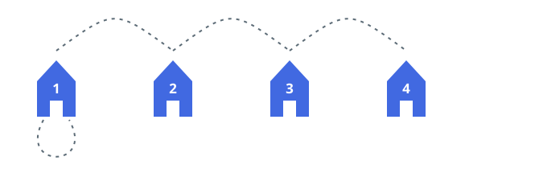

# Street Distances Between Houses I

## Description

A row of `n` houses, numbered `1` through `n`, is joined by `n` streets.
For every `1 <= i <= n - 1` a street connects house `i` with its neighbor
house `i + 1`, and one additional street joins house `x` with house `y`.
That extra street may link a house to itself, in which case it adds
nothing to walk on.

Call two houses `k` streets apart when `k` is the smallest number of
streets a walk between them can use. For each `k` from `1` through `n`,
count the ordered pairs of houses `(a, b)` that are exactly `k` streets
apart.

Return a `result` array of length `n`, indexed from `1`, where `result[k]`
holds the count for distance `k`.

### Example 1



```text
Input: n = 3, x = 1, y = 3
Output: [6,0,0]
Explanation: The shortcut turns the row of three houses into a triangle,
so every pair of distinct houses is directly connected. All 3 x 2 = 6
ordered pairs sit one street apart and no pair is farther away.
```

### Example 2



```text
Input: n = 5, x = 2, y = 4
Output: [10,8,2,0,0]
Explanation: The row's four neighboring pairs contribute the 10 ordered
pairs in the first bucket. The shortcut also stretches across the row:
house 1 reaches houses 3 and 4 in two streets and house 5 reaches houses
2 and 3 in two, which adds 8 ordered pairs at distance 2. Only houses 1
and 5 are farther apart — three streets via the shortcut — and nothing
sits at distance 4 or 5.
```

### Example 3



```text
Input: n = 4, x = 1, y = 1
Output: [6,4,2,0]
Explanation: A street from a house back to itself never shortens a walk,
so this is just a plain row of four houses: six adjacent ordered pairs,
four pairs two streets apart, and the two directions between the end
houses three streets apart.
```

### Constraints

- `2 <= n <= 100`
- `1 <= x, y <= n`

## Hints

### Hint 1

The house count is small enough to afford one search per house. Run a
breadth-first search from every house; the level at which each other house
first appears is its distance, and every such appearance drops one ordered
pair into that distance's bucket.
