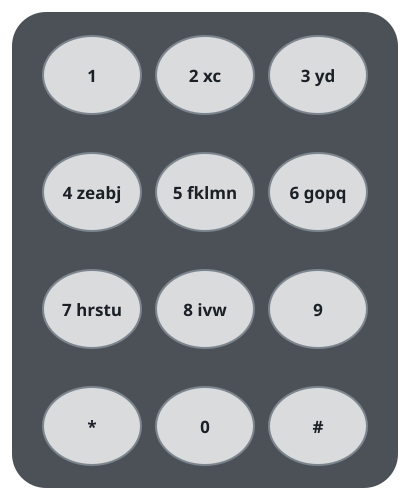
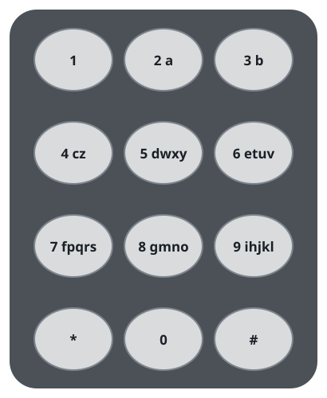

# Fewest Keypresses To Spell A Word II

## Description

A telephone keypad spreads its letters across the number keys, and typing
a letter costs one push per position it holds on its key: the first letter
on a key costs a single push, the second costs two, and so on.

The keys numbered `2` through `9` may be remapped into any distinct
collections of lowercase English letters. A key may carry as many or as
few letters as you like, but every letter must live on exactly one key.
Given a string `word`, remap the keys so that typing `word` uses as few
pushes as possible.

Return that smallest possible push count.

One common arrangement is pictured below; note that `1`, `0`, `*`, and `#`
never carry letters.


### Example 1


```text
Input: word = "abcde"
Output: 5
Explanation: The remapped keypad pictured above gives each of the five
letters the top slot of its own key, so every occurrence costs a single
push: 1 + 1 + 1 + 1 + 1 = 5 pushes. Nothing beats that, because at least
one push per typed letter is unavoidable.
```

### Example 2



```text
Input: word = "xyzxyzxyzxyz"
Output: 12
Explanation: The pictured remapping opens key 2 with "x", key 3 with
"y", and key 4 with "z", so each of the four occurrences of every letter
costs one push: 4 + 4 + 4 = 12. The remaining letters fill other keys and
key 9 stays empty entirely — only the letters of `word` need homes, not
all 26.
```

### Example 3



```text
Input: word = "aabbccddeeffgghhiiiiii"
Output: 24
Explanation: The pictured keypad gives the letters `a` through `g` —
each typed twice — the top slot of its own key, and `i` the top slot of
key 9. That accounts for 7 x 2 + 6 = 20 pushes. `h` sits second on key 9,
so its two occurrences cost two pushes apiece, adding 4. The total of
24 pushes cannot be improved.
```

### Constraints

- `1 <= word.length <= 10^5`
- `word` contains only lowercase English letters.

## Hints

### Hint 1

Eight keys are on offer, so eight letters can cost one push apiece, the
next eight letters two pushes apiece, and so on in bands of eight.

### Hint 2

The total cost depends only on how many letters occupy each push depth,
never on which physical key holds them — so hand the depths out evenly.

### Hint 3

Tally how often each letter occurs, sort those counts from highest to
lowest, and let the most frequent letters take the cheapest depths: the
letter at sorted position `index` costs `index // 8 + 1` pushes every
time it is typed.
