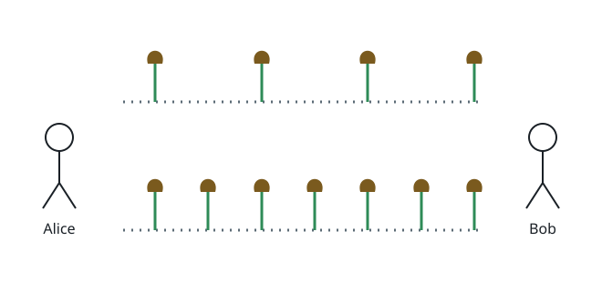

# Winning Flower Pairs

## Description

Alice and Bob play a simple picking game on a field that holds two rows of
flowers between them. The first row starts with `x` flowers and the second
row with `y`. Alice moves first, and the two alternate turns. On a turn the
mover plucks exactly one flower, taken from either row. If a turn ends with
both rows completely empty, the mover who plucked that last flower wins
immediately.



Different starting counts give different winners, so given two integers `n`
and `m`, count the starting positions `(x, y)` that meet all of the
following:

- Alice ends up the winner under the rules above.
- The first row holds `x` flowers, where `1 <= x <= n`.
- The second row holds `y` flowers, where `1 <= y <= m`.

Return how many such starting positions exist.

### Example 1

```text
Input: n = 2, m = 5
Output: 5
Explanation: The winning starting positions are (1,2), (1,4), (2,1),
(2,3), and (2,5) — every position whose two counts do not share a parity.
```

### Example 2

```text
Input: n = 7, m = 7
Output: 24
Explanation: The range [1,7] holds four odd values and three even values,
and a position works exactly when its two counts mix parities, giving
4 * 3 + 3 * 4 = 24 positions.
```

### Constraints

- `1 <= n, m <= 10⁵`

## Hints

### Hint 1

Every turn removes exactly one flower no matter which row it comes from,
so a game that starts with `x + y` flowers always lasts exactly `x + y`
turns. The mover of that final turn wins, so only the parity of `x + y`
decides the winner.

### Hint 2

Alice, moving first, wins precisely the positions where `x + y` is odd.
Count them by pairing the odd values in `[1, n]` with the even values in
`[1, m]` and vice versa.
