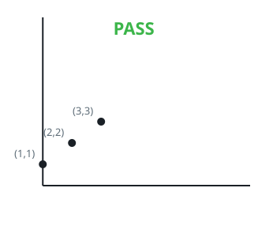
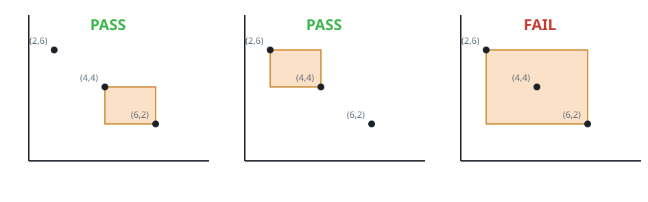
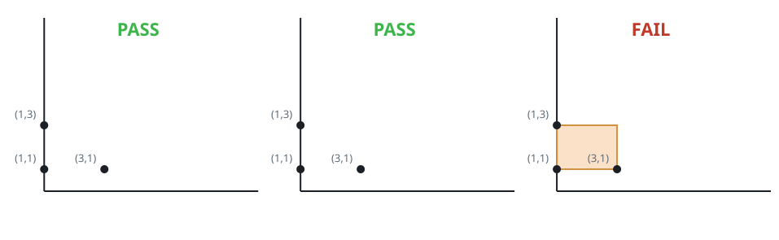

# Quiet Corner Pairs I

## Description

You are given a 2D array `points` of size `n x 2` holding the integer
coordinates of `n` distinct spots on a plane, where `points[i] = [xi, yi]`.

Count the ordered pairs of spots `(A, B)` that satisfy both of the
following:

- `A` sits on the upper left side of `B`: its x-coordinate does not exceed
  B's, and its y-coordinate is not below B's.
- The axis-aligned rectangle with `A` and `B` at opposite corners — possibly
  squashed into a line when the two spots share a height or a width — holds
  no point of the array other than `A` and `B` itself, with spots on the
  border counting as inside.

Return how many such pairs exist.

### Example 1



```text
Input: points = [[1,1],[2,2],[3,3]]
Output: 0
Explanation: The three spots climb one rising diagonal, so no spot is ever
on the upper left side of another — not even a candidate pair exists.
```

### Example 2



```text
Input: points = [[6,2],[4,4],[2,6]]
Output: 2
Explanation:
- The left panel pairs (points[1], points[0]): points[1] is on the upper
  left side of points[0], and nothing else lands in their rectangle.
- The middle panel pairs (points[2], points[1]), which works the same way.
- The right panel pairs (points[2], points[0]); this one fails because
  points[1] lies inside their rectangle.
```

### Example 3



```text
Input: points = [[3,1],[1,3],[1,1]]
Output: 2
Explanation:
- The left panel pairs (points[2], points[0]): the two spots share a
  height, their rectangle collapses to a horizontal line, and an empty
  line is a valid pair.
- The middle panel pairs (points[1], points[2]) along a vertical line,
  which is equally valid.
- The right panel pairs (points[1], points[0]), but points[2] sits on the
  border of their rectangle, and a border point blocks the pair.
```

### Constraints

- `2 <= n <= 50`
- `points[i].length == 2`
- `0 <= points[i][0], points[i][1] <= 50`
- All `points[i]` are distinct.

## Hints

### Hint 1

Every ordered choice of two distinct points is worth one check: decide
which of the two plays the upper-left corner and which the lower-right,
and test the pair directly.

### Hint 2

For a candidate pair with upper-left corner `(x1, y1)` and lower-right
corner `(x2, y2)`, a third point `(x, y)` spoils the pair exactly when
`x1 <= x <= x2` and `y2 <= y <= y1` — the same inequalities, borders
included, that define the rectangle itself.
