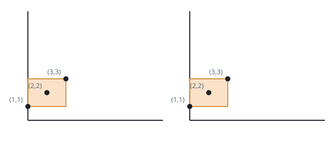
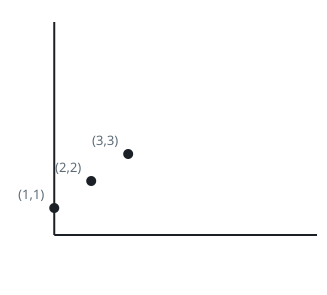
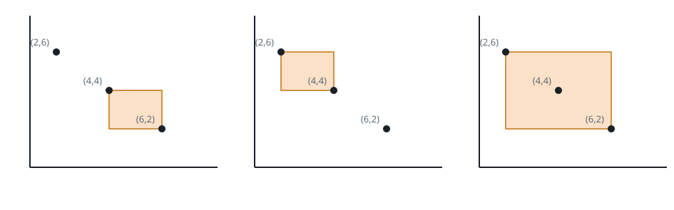
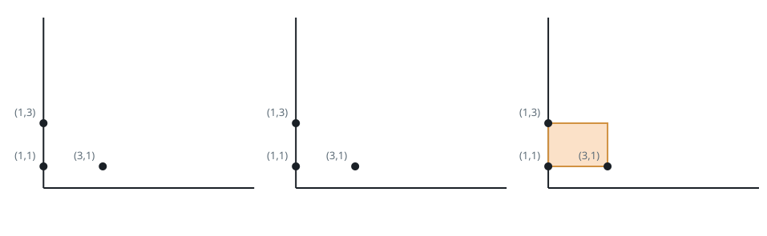

# Quiet Corner Pairs II

## Description

You are given a 2D array `points` of size `n x 2` holding the integer
coordinates of `n` distinct spots on a plane, where `points[i] = [xi, yi]`.
Right means the positive x-direction and left the negative x-direction;
up means the positive y-direction and down the negative y-direction.

Count the ordered pairs of spots `(A, B)` such that:

- `A` is the upper-left end of the pair — A's x-coordinate does not exceed
  B's, and A's y-coordinate is not below B's; and
- the closed rectangle with `A` and `B` at opposite corners holds no spot
  other than those two, with spots on the border counting as inside. The
  rectangle may legitimately have zero width or zero height, i.e. it can
  be a line.

Roles are not interchangeable: the upper-left end must supply the
rectangle's top-left corner and the lower-right end its bottom-right
corner, never the reverse. For example, on the square with corners
(1, 1), (1, 3), (3, 1), and (3, 3) in the picture below, neither drawn
pairing is allowed: pairing (3, 3) with (1, 1) puts the upper-left role on
(3, 3), which is really the square's lower-right corner, and pairing
(1, 3) with (1, 1) is drawn as the full square even though the true
rectangle of that pair is the vertical line between the two spots — within
the drawn square, (1, 1) is not the lower-right corner.



Return how many valid pairs exist.

### Example 1



```text
Input: points = [[1,1],[2,2],[3,3]]
Output: 0
Explanation: The spots climb one rising diagonal, so no spot ends up on
the upper left side of another and there is no valid pair.
```

### Example 2



```text
Input: points = [[6,2],[4,4],[2,6]]
Output: 2
Explanation: Two pairings keep the rectangle empty:
- (points[1], points[0]) — (4, 4) on the upper left side of (6, 2);
- (points[2], points[1]) — (2, 6) on the upper left side of (4, 4).
The remaining candidate (points[2], points[0]) fails because the spot at
(4, 4) lies inside their rectangle.
```

### Example 3



```text
Input: points = [[3,1],[1,3],[1,1]]
Output: 2
Explanation: Two pairings keep the rectangle empty:
- (points[2], points[0]) — (1, 1) and (3, 1) share a height, so their
  rectangle collapses to a horizontal line, and an empty line counts;
- (points[1], points[2]) — likewise a vertical line.
The candidate (points[1], points[0]) fails because the spot at (1, 1)
sits on the border of their rectangle. Whether the rectangle encloses any
area makes no difference — the first two pairings above are valid.
```

### Constraints

- `2 <= n <= 1000`
- `points[i].length == 2`
- `-10⁹ <= points[i][0], points[i][1] <= 10⁹`
- All `points[i]` are distinct.

## Hints

### Hint 1

Sort the spots by x ascending, breaking x-ties by y descending. Every
point that could block a pair then sits strictly between the pair's two
indices in the sorted order.

### Hint 2

Fix the upper-left end and sweep the later indices as candidates for the
lower-right end; any candidate taller than the anchor can play neither
role and is skipped.

### Hint 3

While sweeping, remember the tallest y-coordinate seen so far that does
not exceed the anchor's. A candidate at height `y` is valid exactly when
`y` is strictly greater than that running maximum — a blocker inside the
candidate's rectangle would already have pushed the maximum up to the
blocker's own height.
