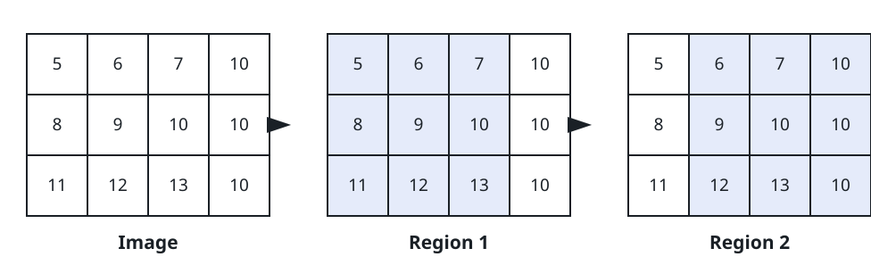
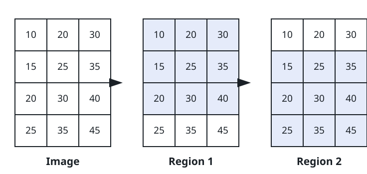

# The Region-Averaged Image

## Description

You are given an `m x n` grid `image` of grayscale intensities, where
`image[i][j]` is a pixel value between 0 and 255, along with a
non-negative integer `threshold`.

Pixels that share an edge are adjacent. A 3 x 3 subgrid is called a
region when the intensity difference between every two adjacent pixels
inside it is at most `threshold`. Every pixel of a qualifying subgrid
belongs to that region, and the same pixel may belong to several regions
at once.

Produce an `m x n` grid `result`, where `result[i][j]` is the average of
the intensities of all regions containing pixel `(i, j)`, rounded down.
Each region first contributes its own average rounded down to an
integer, and the average over the regions is rounded down again. A pixel
that belongs to no region keeps its original value, so `result[i][j]`
equals `image[i][j]` there.

Return the grid `result`.

### Example 1



```text
Input: image = [[5,6,7,10],[8,9,10,10],[11,12,13,10]], threshold = 3
Output: [[9,9,9,9],[9,9,9,9],[9,9,9,9]]
Explanation: Two regions qualify, shaded above. The left one averages
exactly 9; the right one averages 9.67, which floors to 9. Every pixel
lies in the left region, the right region, or both, and the overlap
combines the two floored values as (9 + 9) / 2 = 9. Note the floored 9
is what enters that combination, not 9.67, so every cell of the result
holds 9.
```

### Example 2



```text
Input: image = [[10,20,30],[15,25,35],[20,30,40],[25,35,45]], threshold = 12
Output: [[25,25,25],[27,27,27],[27,27,27],[30,30,30]]
Explanation: Two stacked regions qualify, shaded above: the top one
averages 25 and the bottom one 30. Row 0 sits only in the top region,
so it takes 25; row 3 sits only in the bottom one and takes 30. Rows 1
and 2 belong to both, so they take (25 + 30) / 2 = 27.5 floored to 27.
```

### Example 3

```text
Input: image = [[0,3,6],[3,6,9],[6,9,12]], threshold = 3
Output: [[6,6,6],[6,6,6],[6,6,6]]
Explanation: The only 3 x 3 subgrid qualifies — neighbouring pixels
differ by exactly 3, which equals the threshold. Its nine values sum to
54, an average of 6, and all nine pixels belong to it, so the whole
result is filled with 6.
```

### Example 4

```text
Input: image = [[10,10,10,90],[10,10,10,90],[10,10,10,90]], threshold = 5
Output: [[10,10,10,90],[10,10,10,90],[10,10,10,90]]
Explanation: Only the window over columns 0..2 qualifies; stepping one
column right would bring the 10s next to the 90s, a gap far larger than
the threshold. The covered cells take the region average 10, while the
last column belongs to no region and keeps its original 90.
```

### Constraints

- `3 <= m, n <= 500`
- `0 <= image[i][j] <= 255`
- `0 <= threshold <= 255`

## Hints

### Hint 1

Sweep every possible 3 x 3 window and test its twelve edge-sharing
pairs to decide whether it is a region.

### Hint 2

Maintain a sum grid and a count grid: a qualifying region adds its
floored average to the sum and one to the count of each of its nine
pixels.

### Hint 3

A covered pixel answers `sum / count`, floored once more; a pixel with
`count == 0` falls back to its original intensity. Prefix sums make
each window's total a constant-time lookup.
