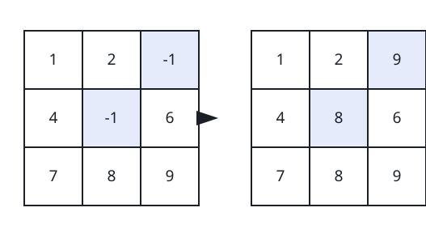
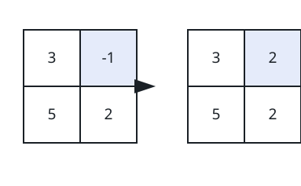

# Fill The Matrix Blanks

## Description

You are given a 0-indexed `m x n` integer matrix `matrix` in which the
value `-1` marks a blank cell.

Build an answer matrix that starts as a copy of `matrix`, then fill in
every blank: each `-1` is replaced by the largest value appearing
anywhere in its own column. All other cells keep their values.

Return the completed matrix.

### Example 1



```text
Input: matrix = [[1,2,-1],[4,-1,6],[7,8,9]]
Output: [[1,2,9],[4,8,6],[7,8,9]]
Explanation: The cells that get rewritten are highlighted above. Cell
[1][1] takes 8, the largest value in column 1, and cell [0][2] takes 9,
the largest value in column 2. Everything else copies over unchanged.
```

### Example 2



```text
Input: matrix = [[3,-1],[5,2]]
Output: [[3,2],[5,2]]
Explanation: The single blank cell [0][1] is filled with 2, the largest
value in column 1, as highlighted above.
```

### Example 3

```text
Input: matrix = [[2,-1,0],[-1,5,-1],[4,1,7]]
Output: [[2,5,0],[4,5,7],[4,1,7]]
Explanation: The column maxima are 4, 5 and 7. Column 0's blank cell
[1][0] becomes 4, column 1's blank cell [0][1] becomes 5, and column
2's blank cell [1][2] becomes 7.
```

### Constraints

- `m == matrix.length`
- `n == matrix[i].length`
- `2 <= m, n <= 50`
- `-1 <= matrix[i][j] <= 100`
- Each column of `matrix` is guaranteed to contain at least one
  non-negative integer.
