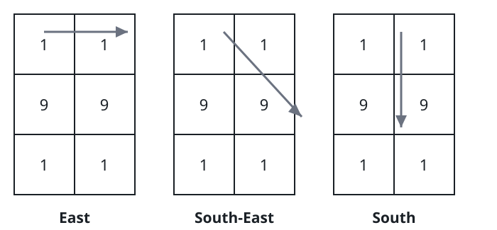

# The Grid's Favorite Prime

## Description

You are given an `m x n` 0-indexed grid of digits `mat`. From any starting
cell you may pick one of the eight compass directions — east, south-east,
south, south-west, west, north-west, north, north-east — and walk a straight
line to the edge of the grid, reading the digits you cross. Turning mid-walk
is not allowed. Every prefix of the walk is a number in its own right: a walk
whose digits read 1, 9, 1 produces 1, then 19, then 191.

Among all numbers produced this way, return the prime greater than 10 that
occurs most often, or `-1` if no such prime exists. When several primes share
the top frequency, return the largest of them.

### Example 1



```text
Input: mat = [[1,1],[9,9],[1,1]]
Output: 19
Explanation: Walking straight lines across this grid produces only the
numbers 11, 19, 191, 91, and 99. Of these, three are primes above 10:
11 appears 4 times, 191 appears 4 times, and 19 appears 8 times, so 19
is the most frequent and is returned.
```

### Example 2

```text
Input: mat = [[2,2],[2,2]]
Output: -1
Explanation: Every straight reading yields 22, 222, or 2222 — all even, so
no number greater than 10 is ever prime.
```

### Example 3

```text
Input: mat = [[1,3,1]]
Output: 131
Explanation: Reading inward from either end produces 13 and then 131;
reading outward from the middle produces 31 twice. The primes 13, 31, and
131 each occur exactly twice, and the tie is broken toward the largest, 131.
```

### Constraints

- `m == mat.length`
- `n == mat[i].length`
- `1 <= m, n <= 6`
- `1 <= mat[i][j] <= 9`

## Hints

### Hint 1

From every cell, extend each of the eight directions cell by cell until you
leave the grid, folding each new digit into the running number; every
extension is one more candidate value.

### Hint 2

Tally only the candidates greater than 10 that survive a primality test,
then take the highest tally, preferring the larger prime on ties.
