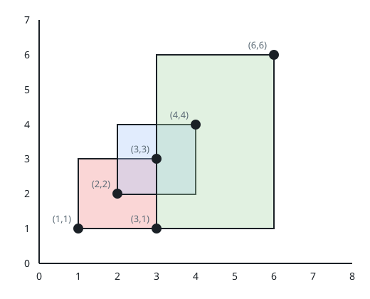
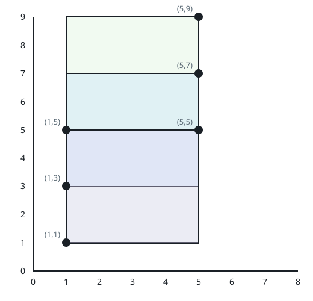
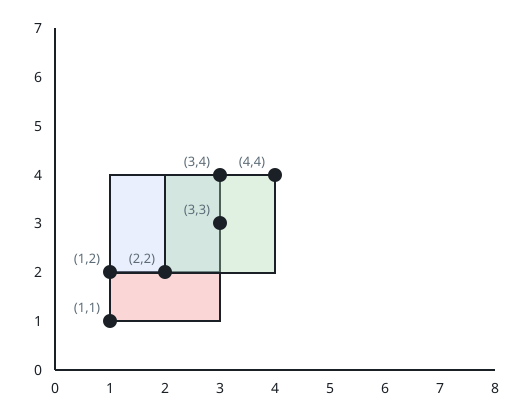
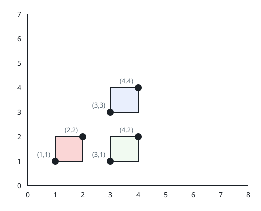

# The Largest Square Two Rectangles Share

## Description

There are `n` axis-aligned rectangles on a 2D plane. Two integer arrays
`bottomLeft` and `topRight` describe them: `bottomLeft[i] = [a_i, b_i]` holds
the lower-left corner of the `i`-th rectangle and `topRight[i] = [c_i, d_i]`
its upper-right corner.

Every pair of rectangles may overlap. Wherever at least two rectangles
overlap, the shared region can host an axis-aligned square; report the
largest area such a square can have. If no two rectangles share any region —
so no such square exists — return `0`.

### Example 1



```text
Input: bottomLeft = [[1,1],[2,2],[3,1]], topRight = [[3,3],[4,4],[6,6]]
Output: 1
Explanation: Rectangles 0 and 1 overlap, and so do rectangles 1 and 2; in
either shared region the widest square that fits has side 1, giving area 1.
No shared region admits a side longer than 1.
```

### Example 2



```text
Input: bottomLeft = [[1,1],[1,3],[1,5]], topRight = [[5,5],[5,7],[5,9]]
Output: 4
Explanation: Consecutive rectangles overlap on a 2-by-2 region, so a square
of side 2 fits and the best area is 2 * 2 = 4. No shared region allows a
longer side.
```

### Example 3



```text
Input: bottomLeft = [[1,1],[2,2],[1,2]], topRight = [[3,3],[4,4],[3,4]]
Output: 1
Explanation: Any two of the three rectangles share a region large enough
for a square of side 1 but nothing larger, so the maximum area is 1. Note
that a shared region may be covered by more than two rectangles at once.
```

### Example 4



```text
Input: bottomLeft = [[1,1],[3,3],[3,1]], topRight = [[2,2],[4,4],[4,2]]
Output: 0
Explanation: No rectangle overlaps any other, so there is no shared region
and the answer is 0.
```

### Constraints

- `n == bottomLeft.length == topRight.length`
- `2 <= n <= 10³`
- `bottomLeft[i].length == topRight[i].length == 2`
- `1 <= bottomLeft[i][0], bottomLeft[i][1] <= 10⁷`
- `1 <= topRight[i][0], topRight[i][1] <= 10⁷`
- `bottomLeft[i][0] < topRight[i][0]`
- `bottomLeft[i][1] < topRight[i][1]`

## Hints

### Hint 1

Examining every pair of rectangles directly is enough at these sizes — work
out each pair's shared region.

### Hint 2

A pair misses each other precisely when one rectangle's left edge sits at or
beyond the other's right edge, or likewise vertically.

### Hint 3

When two rectangles do overlap, their shared region is itself a rectangle —
clamp each axis between the higher of the two low edges and the lower of the
two high edges to find its corners.
