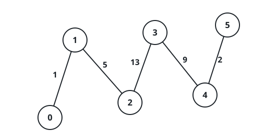
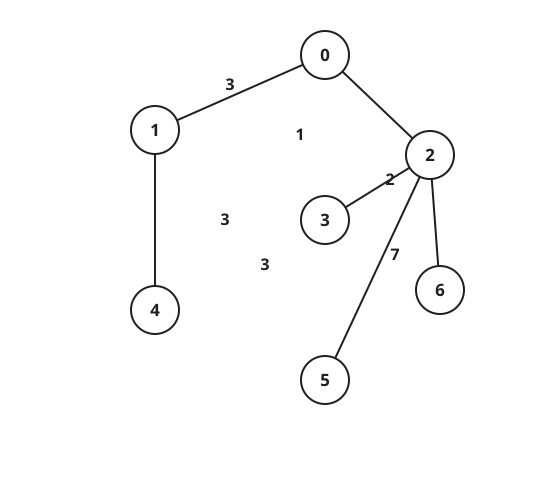

# Server Pairs Linked Through Each Relay

## Description

An unrooted weighted tree holds `n` servers numbered `0` through `n - 1`.
Its wiring is given as `edges`, where `edges[i] = [ai, bi, weighti]` is an
undirected link joining `ai` and `bi` with a distance of `weighti`. You are
also given an integer `signalSpeed`.

Servers `a` and `b` can talk through a server `c` when all of these hold:

- `a < b`, and neither endpoint equals `c`.
- The distance from `c` to `a` is a multiple of `signalSpeed`.
- The distance from `c` to `b` is a multiple of `signalSpeed`.
- The routes `c -> a` and `c -> b` share no edge.

Build an array `count` of length `n` where `count[i]` is the number of
server pairs that can talk through server `i`.

### Example 1



```text
Input: edges = [[0,1,1],[1,2,5],[2,3,13],[3,4,9],[4,5,2]], signalSpeed = 1
Output: [0,4,6,6,4,0]
Explanation: Since signalSpeed is 1, every distance qualifies, and count[c] is simply the number of path pairs leaving c that share no edge. Along this chain that is the number of servers on the left of c multiplied by the number of servers on its right.
```

### Example 2



```text
Input: edges = [[0,6,3],[6,5,3],[0,3,1],[3,2,7],[3,1,6],[3,4,2]], signalSpeed = 3
Output: [2,0,0,0,0,0,2]
Explanation: Server 0 relays two pairs, (4, 5) and (4, 6), and server 6 also relays two pairs, (4, 5) and (0, 5). No pair can talk through any of the remaining servers.
```

### Constraints

- `2 <= n <= 1000`
- `edges.length == n - 1`
- `edges[i].length == 3`
- `0 <= ai, bi < n`
- `edges[i] = [ai, bi, weighti]`
- `1 <= weighti <= 10⁶`
- `1 <= signalSpeed <= 10⁶`
- The links in `edges` always form a valid tree.

## Hints

### Hint 1

Take each server in turn as the tree's root and run a DFS, recording for
every subtree how many of its nodes sit at a distance from the root that
`signalSpeed` divides.

### Hint 2

If the root's children `c1, c2, …, cm` carry qualifying counts
`num[c1], num[c2], …, num[cm]` and `S` is their sum, then a pair relayed
through the root is one qualifying server from each of two different
branches, so the total is half of `num[ci] * (S - num[ci])` summed over all
branches.
