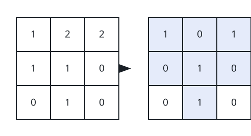
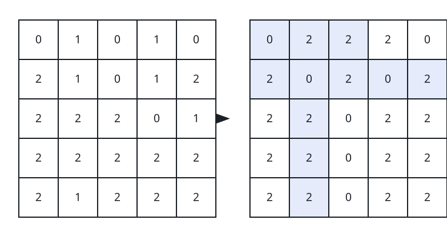

# Painting a Y onto the Grid

## Description

You are given an `n x n` grid of values with `n` odd; rows and columns are
indexed from `0`, and every cell holds a `0`, a `1`, or a `2`.

A cell belongs to the Y-shape when it lies on any of these three arms:

- the diagonal running from the top-left corner down to the center cell;
- the diagonal running from the top-right corner down to the center cell;
- the vertical stroke that runs from the center cell straight down to the
  bottom edge.

The grid displays the letter Y exactly when:

- all cells on the Y-shape hold one common value;
- all cells off the Y-shape hold one common value;
- the on-shape and off-shape values differ from each other.

A single move overwrites one chosen cell with `0`, `1`, or `2`. Return the
fewest moves that turn the given grid into a picture of the letter Y.

### Example 1



```text
Input: grid = [[1,2,2],[1,1,0],[0,1,0]]
Output: 3
Explanation: The image marks (in blue) the cells worth repainting. After
those three moves every cell on the Y arms holds the value 1 — shown in
bold in the image — while every cell off the arms holds 0. Fewer than 3
moves cannot produce a valid Y.
```

### Example 2



```text
Input: grid = [[0,1,0,1,0],[2,1,0,1,2],[2,2,2,0,1],[2,2,2,2,2],[2,1,2,2,2]]
Output: 12
Explanation: The image marks (in blue) a cheapest set of twelve moves. It
leaves the value 0 — shown in bold — on every cell of the Y arms and the
value 2 everywhere else, and no valid painting of this grid uses fewer
moves.
```

### Constraints

- `3 <= n <= 49`, and `n` is odd.
- The grid is square: `n == grid.length == grid[i].length`.
- Every `grid[i][j]` is `0`, `1`, or `2`.
