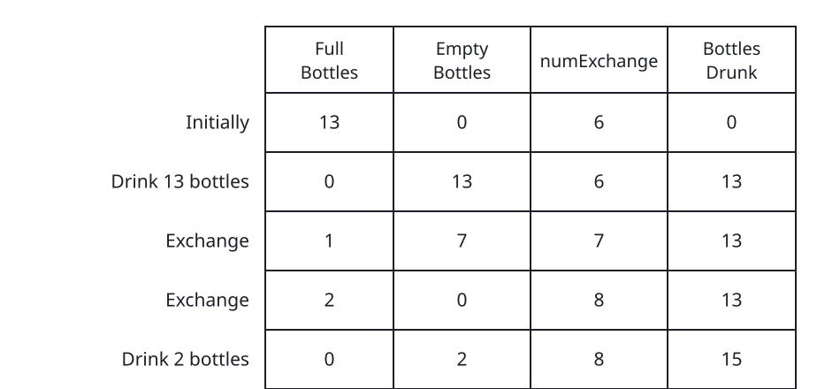
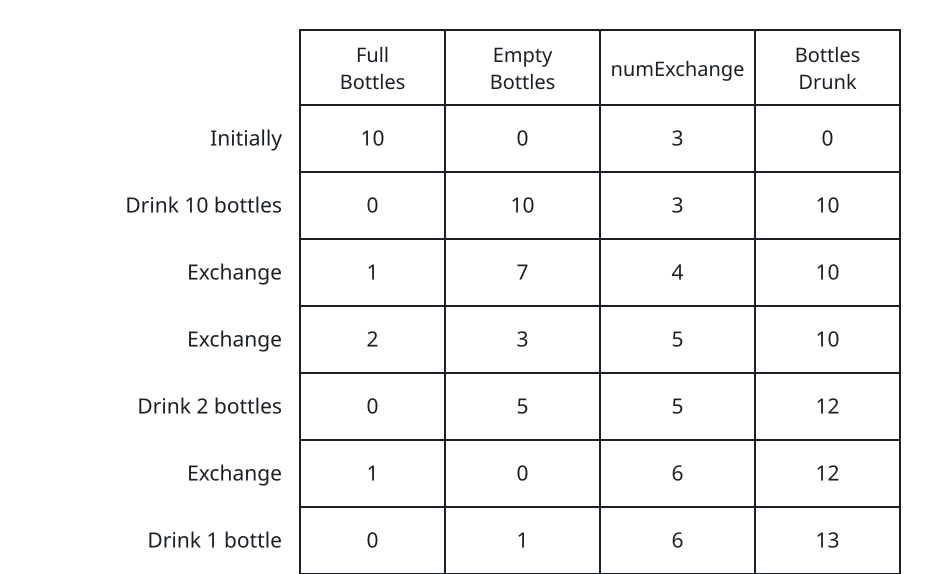

# More Drinks as Prices Climb II

## Description

You start out holding `numBottles` full water bottles, and you intend to
drink as many of them — and their successors — as you can. Empty bottles
can be traded back in, but the going rate keeps rising. Whenever you like,
you may take either of these moves:

- Drink any number of the full bottles you currently hold; each one leaves
  you an empty bottle.
- Hand over exactly `numExchange` empty bottles in exchange for one new
  full bottle; once the trade is done, `numExchange` increases by one.

The rate is charged per trade, so a single `numExchange` value cannot pay
for several bottles at once. For example, with `numBottles == 3` and
`numExchange == 1`, you may not spend 3 empty bottles on 3 full bottles in
one go — after the first trade the price has already moved up.

Return the largest number of water bottles you can end up drinking.

### Example 1



```text
Input: numBottles = 13, numExchange = 6
Output: 15
Explanation: The table walks the optimal schedule round by round — full
bottles in hand, empties in stock, the current numExchange price, and the
running count of bottles drunk. The opening haul funds two trades at
prices 6 and 7, and the two bottles they return lift the total to 15.
```

### Example 2



```text
Input: numBottles = 10, numExchange = 3
Output: 13
Explanation: The table above follows the same bookkeeping for this start:
ten drinks fund three trades at prices 3, 4, and 5, and the three bottles
those trades return are drunk in later rounds, lifting the running total
to 13.
```

### Constraints

- `1 <= numBottles <= 100`
- `1 <= numExchange <= 100`

## Hints

### Hint 1

Play the rounds out directly: drain every full bottle you hold, then spend
empties on exactly one trade at the current price, and keep going while
the stock can still cover it.

### Hint 2

Waiting never helps. Drinking is always safe — it grows both the total and
the empty stock — and because every completed trade raises `numExchange`,
cheap trades should always be taken before expensive ones.
