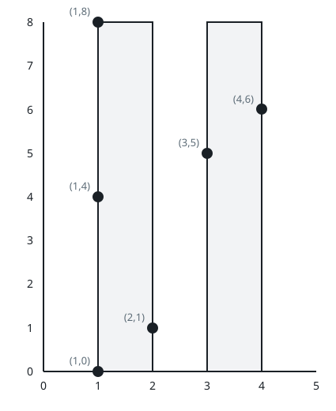
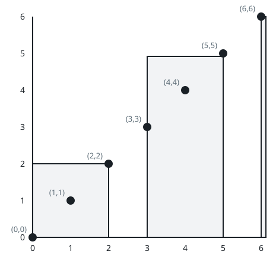
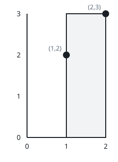

# Framing All The Points

## Description

You receive a 2D integer array `points` where points[i] = [xi, yi], and
an integer `w`. Your job is to place frames so every given point ends up
inside at least one of them.

Each frame is a rectangle whose bottom edge sits somewhere on the x-axis
— it starts at (x1, 0) and rises to an upper end at (x2, y2) — subject
to x1 <= x2, y2 >= 0, and the width limit x2 - x1 <= w. A point counts
as framed when it lies inside its frame or on that frame's boundary.

How many frames are needed, at minimum, so that each point is covered by
at least one? A single point is allowed to sit inside several frames at
once.

### Example 1



```text
Input: points = [[2,1],[1,0],[1,4],[1,8],[3,5],[4,6]], w = 1
Output: 2
Explanation: For instance, one frame runs from x = 1 to x = 2 (rising
high enough to take in (1,0), (1,4), (1,8) and (2,1)), and a second
frame runs from x = 3 to x = 4 (catching (3,5) and (4,6)).
```

### Example 2



```text
Input: points = [[0,0],[1,1],[2,2],[3,3],[4,4],[5,5],[6,6]], w = 2
Output: 3
Explanation: Three frames suffice — for example one over x in [0, 2],
one over [3, 5], and a degenerate one standing on x = 6.
```

### Example 3



```text
Input: points = [[2,3],[1,2]], w = 0
Output: 2
Explanation: With zero width a frame can hold only points sharing one
x coordinate, so the two points need separate frames.
```

### Constraints

- `1 <= points.length <= 10⁵`
- `points[i].length == 2`
- `0 <= xi == points[i][0] <= 10⁹`
- `0 <= yi == points[i][1] <= 10⁹`
- `0 <= w <= 10⁹`
- No two points share the same (xi, yi) pair.

## Hints

### Hint 1

The y coordinates are irrelevant — a frame may rise as high as needed.

### Hint 2

Order the points by their x coordinate.

### Hint 3

Repeatedly take the leftmost point not yet framed and start a frame at
its x; that frame captures every point whose x is at most that value
plus `w`.
