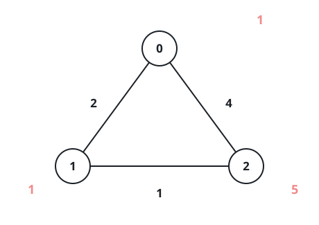
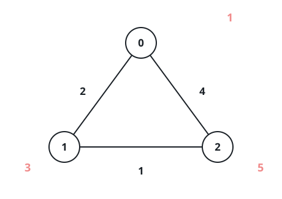

# Reaching Nodes Before They Vanish

## Description

An undirected graph has `n` nodes, numbered from `0`. A 2D array `edges`
lists its connections: `edges[i] = [ui, vi, lengthi]` means walking
between node `ui` and node `vi` costs `lengthi` units of time.

Separately, an array `disappear` gives each node a deadline — node `i`
vanishes at time `disappear[i]`, and from that moment on it can no
longer be visited.

The graph may be disconnected, and two nodes may be joined by several
edges.

Output an array `answer` where `answer[i]` is the smallest amount of
time that gets you to node `i` starting from node `0` — counting only
arrivals that happen strictly before the node's deadline. When node `i`
cannot be reached in time (or at all), `answer[i]` is `-1`.

### Example 1



```text
Input: n = 3, edges = [[0,1,2],[1,2,1],[0,2,4]], disappear = [1,1,5]
Output: [0,-1,4]
Explanation: Setting out from node 0: reaching it costs nothing. The
quickest route to node 1 spends 2 units on edges[0], but the node is
already gone at that exact instant, so it is lost. For node 2, the
direct 4-unit trip along edges[2] is the fastest way there.
```

### Example 2



```text
Input: n = 3, edges = [[0,1,2],[1,2,1],[0,2,4]], disappear = [1,3,5]
Output: [0,2,3]
Explanation: From node 0, node 1 costs the 2 units of edges[0] and we
arrive before its deadline. Node 2 is best served by edges[0] followed
by edges[1], a total of 3 units.
```

### Example 3

```text
Input: n = 4, edges = [[0,1,3],[1,2,2],[0,3,7]], disappear = [5,3,6,9]
Output: [0,-1,-1,7]
Explanation: Node 0 is free. The 3-unit walk along edges[0] reaches
node 1 at the very instant it vanishes, so it cannot be visited — and
node 2, whose only route passes through node 1, is stranded as well.
Node 3 still needs 7 units via edges[2], comfortably inside its
deadline of 9.
```

### Constraints

- `1 <= n <= 5 * 10⁴`
- `0 <= edges.length <= 10⁵`
- `edges[i] == [ui, vi, lengthi]`
- `0 <= ui, vi <= n - 1`
- `1 <= lengthi <= 10⁵`
- `disappear.length == n`
- `1 <= disappear[i] <= 10⁵`

## Hints

### Hint 1

Run Dijkstra from node `0`, but treat every node's deadline as a filter:
only settle a node whose arrival time beats its vanishing instant.
