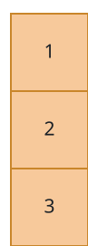

# Cheapest Uniform Columns

## Description

You are given an `m x n` grid of non-negative integers. A single operation
overwrites any one cell with any non-negative number of your choosing.

After your operations, every cell must obey two neighbour rules:

- It matches the cell directly below it, when that cell exists:
  `grid[i][j] == grid[i + 1][j]`.
- It differs from the cell directly to its right, when that cell exists:
  `grid[i][j] != grid[i][j + 1]`.

Return the fewest operations that can make the entire grid legal.

### Example 1


```text
Input: grid = [[1,0,2],[1,0,2]]
Output: 0
Explanation: The grid already obeys both rules, so nothing needs changing.
```

### Example 2


```text
Input: grid = [[1,1,1],[0,0,0]]
Output: 3
Explanation: Three overwrites produce the legal grid [[1,0,1],[1,0,1]]:
set grid[1][0] to 1, grid[0][1] to 0, and grid[1][2] to 1.
```

### Example 3



```text
Input: grid = [[1],[2],[3]]
Output: 2
Explanation: A lone column only has to become constant, so two overwrites
make every cell hold 1.
```

### Constraints

- `1 <= m, n <= 1000`
- `0 <= grid[i][j] <= 9`
