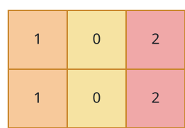
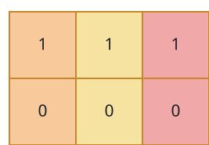

# The Steady-Column Grid

## Description

A grid of integers with `m` rows and `n` columns is given. Call the
grid steady when two rules hold everywhere they can:

- Reading down a column, each cell matches the one directly beneath
  it — `grid[i][j] == grid[i + 1][j]` whenever row `i + 1` exists.
- Reading across a row, each cell differs from its right-hand
  neighbour — `grid[i][j] != grid[i][j + 1]` whenever column
  `j + 1` exists.

Return `true` when the grid is steady and `false` otherwise.

### Example 1



```text
Input: grid = [[1,0,2],[1,0,2]]
Output: true
Explanation: Every column repeats a single value from top to bottom,
and no two side-by-side columns share a value.
```

### Example 2



```text
Input: grid = [[1,1,1],[0,0,0]]
Output: false
Explanation: The top row spells the same value three times across,
so the horizontal rule is broken at once.
```

### Example 3


```text
Input: grid = [[1],[2],[3]]
Output: false
Explanation: The single column changes value with every step down,
so the vertical rule fails.
```

### Constraints

- `1 <= n, m <= 10`
- `0 <= grid[i][j] <= 9`
