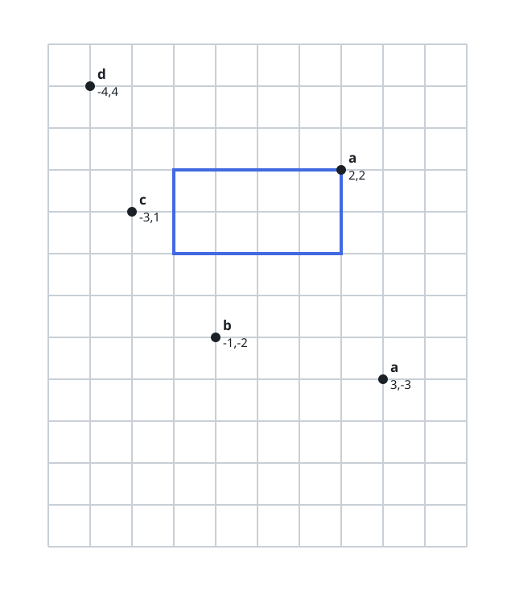
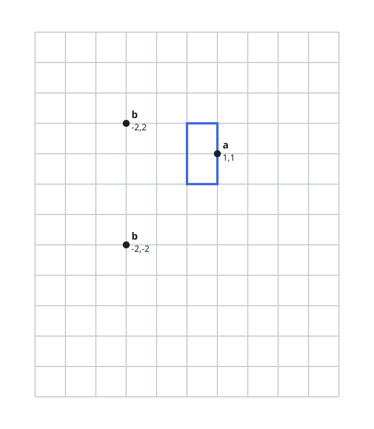

# The Square That Never Repeats A Tag

## Description

You are given a list of points and an aligned string of tags: point `i`
occupies `points[i]` and carries tag `s[i]`.

Consider squares centered at the origin whose sides are parallel to the
axes. Call such a square clean when it never holds two points bearing
the same tag. Choose the clean square that holds the most points and
return that count.

Two clarifications: a point lying exactly on the square's boundary
counts as held, and a square may shrink until its side length is zero.

### Example 1



```text
Input: points = [[2,2],[-1,-2],[-4,4],[-3,1],[3,-3]], s = "abdca"
Output: 2
Explanation:
A square with side length 4 reaches `points[0]` and `points[1]`; the
other three points sit farther out, and the two held tags `a` and `b`
differ.
```

### Example 2



```text
Input: points = [[1,1],[-2,-2],[-2,2]], s = "abb"
Output: 1
Explanation:
With side length 2 only `points[0]` falls inside; growing further to
admit either of the `b` points would admit both.
```

### Example 3

```text
Input: points = [[2,-2],[-2,2],[6,1]], s = "ppq"
Output: 0
Explanation:
`points[0]` and `points[1]` share tag `p` and sit equally far from the
origin, so every square that reaches one of them swallows both at once —
no clean square can hold anything.
```

### Constraints

- `1 <= points.length = s.length <= 10⁵`
- `points[i].length == 2`
- `-10⁹ <= points[i][0], points[i][1] <= 10⁹`
- All points have pairwise distinct coordinates.
- `s` contains only lowercase English letters.

## Hints

### Hint 1

A square with half side `D` holds exactly the points whose value
`max(|x|, |y|)` is at most `D`. So rank the points by that value and
every square corresponds to a prefix of the ranking.

### Hint 2

Points tied on `max(|x|, |y|)` must enter or stay out together. Sweep
the ranked list outward with a set of tags already collected; the first
tie group that repeats a tag — within itself or against earlier groups
— stops the count.
