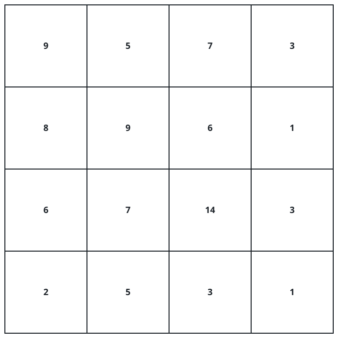
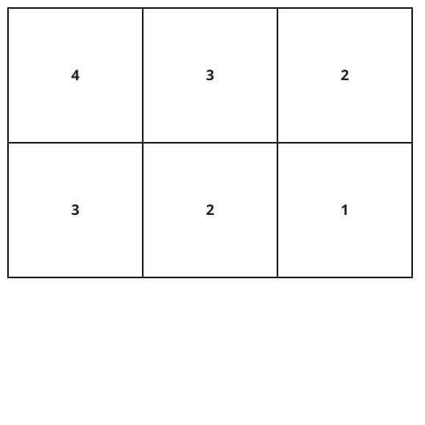

# The Steepest Climb In A Matrix

## Description

You are handed an `m x n` matrix `grid` of positive integers. From a
cell you may jump to a lower cell in its own column or to a cell
further right in its own row — skipping over intermediate cells is
allowed. Leaping from a cell holding `c1` to one holding `c2` earns
`c2 - c1`.

You pick the starting cell yourself, and you must make at least one
jump.

Return the largest total you can accumulate.

### Example 1



```text
Input: grid = [[9,5,7,3],[8,9,6,1],[6,7,14,3],[2,5,3,1]]
Output: 9
Explanation:
Open at the cell (0, 1), whose value is 5, then:
- Drop to (2, 1), earning 7 - 5 = 2.
- Slide right to (2, 2), earning 14 - 7 = 7.
The two jumps total 2 + 7 = 9.
```

### Example 2



```text
Input: grid = [[4,3,2],[3,2,1]]
Output: -1
Explanation:
Every jump lands on a smaller value, so a loss is unavoidable. Opening
at (0, 0) and sliding right to (0, 1) loses the least: 3 - 4 = -1.
```

### Constraints

- `m == grid.length`
- `n == grid[i].length`
- `2 <= m, n <= 1000`
- `4 <= m * n <= 10⁵`
- `1 <= grid[i][j] <= 10⁵`

## Hints

### Hint 1

Intermediate cells cancel: jumping `a` to `b` and then `b` to `c` earns
`(b - a) + (c - b)`, which is just `c - a`. A whole journey is worth its
end value minus its start value.

### Hint 2

So only the pair matters: for each cell playing the role of end, the
best partner is the smallest value in the region up and to its left,
excluding itself. A single row-major sweep that carries a running
minimum prices every cell in constant time.
