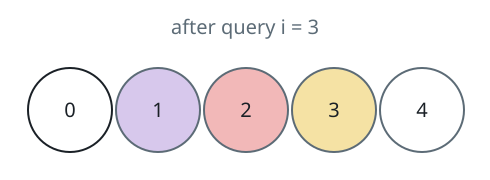
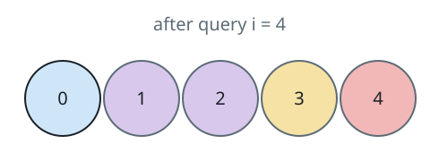

# Counting the Colors in Play

## Description

There are `limit + 1` balls, carrying distinct labels `0` through
`limit`, and none of them is painted at the start.

Each entry of the 2D array `queries` is a pair `[x, y]` meaning: paint
ball `x` with color `y`, replacing whatever color it wore before. Right
after every query, count how many different colors are currently worn
by at least one ball — unpainted balls contribute nothing.

Return an array where entry `i` is that count after query `i`.

### Example 1



```text
Input: limit = 4, queries = [[1,4],[2,5],[1,3],[3,4]]
Output: [1,2,2,3]
Explanation:
Ball 1 is painted first, ball 2 joins with a new color, ball 1 then
switches colors (leaving the total unchanged), and ball 3 finally adds
a third distinct color.
```

### Example 2



```text
Input: limit = 4, queries = [[0,1],[1,2],[2,2],[3,4],[4,5]]
Output: [1,2,2,3,4]
Explanation:
Five fresh balls are painted in turn; only the third query reuses ball
2's already-live color, so the count holds at 2 for one step before
climbing to 4.
```

### Example 3

```text
Input: limit = 3, queries = [[0,10],[1,10],[0,20],[1,11],[2,10]]
Output: [1,1,2,2,3]
Explanation:
Balls 0 and 1 share color 10, then both are repainted (ball 0 to 20,
ball 1 to 11), and ball 2 revives color 10 — the totals move 1, 1, 2,
2, 3.
```

### Constraints

- `1 <= limit <= 10⁹`
- `1 <= n == queries.length <= 10⁵`
- `queries[i].length == 2`
- `0 <= queries[i][0] <= limit`
- `1 <= queries[i][1] <= 10⁹`

## Hints

### Hint 1

Hold each ball's current color in one map and, in a second map, how
many balls currently wear each color; a repaint is one decrement and
one increment between those maps.

### Hint 2

A color dies exactly when its wearer count reaches zero, so the number
of surviving entries in the second map is the count to report.
