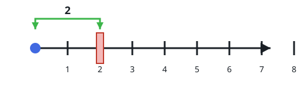
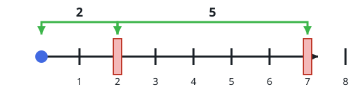

# Fitting Blocks Around Obstacles

## Description

Picture a number line starting at 0 and running forever in the positive
direction.

The 2D array `queries` carries two kinds of operations:

- `[1, x]` — drop an obstacle at distance `x` from the origin. The input
  guarantees no obstacle already sits at `x`.
- `[2, x, sz]` — ask whether a block of length `sz` can be laid entirely
  inside the segment `[0, x]`. A block may share an edge with an obstacle
  but may not cover one, and nothing is actually placed: every such query
  is judged against the obstacles seen so far, independently.

Return a boolean array `results` where `results[i]` answers the `i`-th
type-2 query.

### Example 1



```text
Input: queries = [[1,2],[2,3,3],[2,3,1],[2,2,2]]
Output: [false,true,true]
Explanation:
An obstacle lands at x = 2. A length-3 block inside [0,3] has no choice
but to run over it, so the first check fails; a unit block tucks in
before the obstacle, and a length-2 block ends exactly on it, which
touching allows.
```

### Example 2



```text
Input: queries = [[1,7],[2,7,6],[1,2],[2,7,5],[2,7,6]]
Output: [true,true,false]
Explanation:
With the line empty, a length-6 block slides into [0,7]. Once an
obstacle sits at x = 2, a length-5 block still fits by starting right
at the obstacle, but no length-6 block can avoid covering it.
```

### Example 3

```text
Input: queries = [[1,4],[2,4,4],[2,4,5],[1,6],[2,6,2],[2,9,3]]
Output: [true,false,true,true]
Explanation:
An obstacle at x = 4 lets a length-4 block end flush on it but blocks
length 5. After another obstacle at x = 6, short blocks still fit on
either side — one may even start flush at 6.
```

### Constraints

- `1 <= queries.length <= 15 * 10⁴`
- `2 <= queries[i].length <= 3`
- `1 <= queries[i][0] <= 2`
- `1 <= x, sz <= min(5 * 10⁴, 3 * queries.length)`
- Type-1 queries never repeat a distance `x`.
- At least one query is of type 2.

## Hints

### Hint 1

For each candidate start `i`, only one number matters: the distance
from `i` to the first obstacle strictly ahead of it.

### Hint 2

A block of size `sz` fits in `[0, x]` exactly when some start
`s <= x - sz` has that distance reach `sz` — a range maximum over the
starts, compared against `sz`.

### Hint 3

A new obstacle overwrites one contiguous stretch of distances; a lazy
segment tree, aided by a quick "previous obstacle" lookup, keeps every
operation logarithmic.
