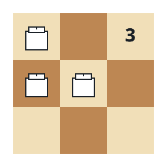
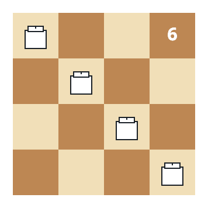

# Settling Rooks Into Line

## Description

An `n x n` chessboard holds `n` rooks; `rooks[i] = [xi, yi]` gives the
starting cell of the i-th rook. In one move a rook slides to an adjacent
cell — one step up, down, left, or right. The board is settled when the
rooks occupy every row exactly once and every column exactly once.

Return the minimum total number of moves needed to settle the board.
Two rooks may never stand on the same cell, at any moment.

### Example 1



```text
Input: rooks = [[0,0],[1,0],[1,1]]
Output: 3
Explanation:
Row two holds two rooks while its bottom neighbor is empty, and one
column ends up doubled too; three single-cell steps untangle both
axes.
```

### Example 2



```text
Input: rooks = [[0,0],[0,1],[0,2],[0,3]]
Output: 6
Explanation:
All four rooks start stacked in the first row, so each one walks
straight to its own row: 0 + 1 + 2 + 3 = 6 moves, and the columns
settle for free.
```

### Example 3

```text
Input: rooks = [[1,1],[1,2],[2,0],[0,3]]
Output: 2
Explanation:
The columns already hold one rook each. Two rooks share the second
row, and nudging them into the two empty rows costs 1 + 1 = 2 moves.
```

### Constraints

- `1 <= n == rooks.length <= 500`
- `0 <= xi, yi <= n - 1`
- No two rooks start on the same cell.

## Hints

### Hint 1

One move changes exactly one of the two coordinates, so the row story
and the column story can be settled independently and their costs
added.

### Hint 2

Settling one axis means turning its `n` coordinates into the values
`0..n-1` in some order. Sort that axis's coordinates and send the
k-th smallest to target `k - 1` — a greedy pass that costs
`sum |coordinate - target|`.

### Hint 3

Pairing sorted coordinates with sorted targets is optimal by the
rearrangement inequality, and the axis-by-axis schedule can always be
carried out without two rooks ever sharing a cell.
