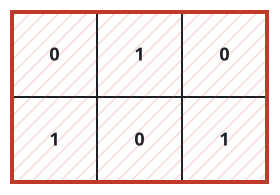
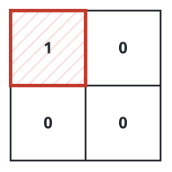

# The Tightest Cover For All Ones I

## Description

A binary matrix `grid` scatters some cells marked `1` across a field of
`0`s. Pick a rectangle whose sides run parallel to the matrix's rows and
columns and which contains every marked cell, keeping its area as small as
possible.

Return that smallest achievable area.

### Example 1



```text
Input: grid = [[0,1,0],[1,0,1]]
Output: 6
Explanation: The marked cells reach across all three columns and down
through both rows, so nothing smaller than the full 2 * 3 = 6 rectangle
can hold them all.
```

### Example 2



```text
Input: grid = [[1,0],[0,0]]
Output: 1
Explanation: One lone marked cell is covered exactly by a 1 * 1 rectangle.
```

### Constraints

- `1 <= grid.length, grid[i].length <= 1000`.
- Every `grid[i][j]` is `0` or `1`.
- The matrix is guaranteed to contain at least one `1`.

## Hints

### Hint 1

Nothing about the cover is negotiable: it must reach the topmost and
bottommost marked rows and the leftmost and rightmost marked columns. Locate
those four extremes; the answer is their row span times their column span.
