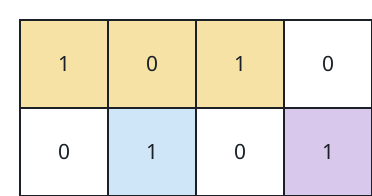

# The Tightest Cover For All Ones II

## Description

A binary matrix `grid` scatters some cells marked `1` across a field of
`0`s. This time the cover consists of **three** rectangles with
axis-parallel sides and positive area. They must not overlap one another —
sharing an edge is fine — and together they must contain every marked cell.

Return the smallest possible total of the three rectangles' areas.

### Example 1


```text
Input: grid = [[1,0,1],[1,1,1]]
Output: 5
Explanation: A 2-cell rectangle takes in the marked column at column 0,
another 2-cell rectangle the marked column at column 2, and the remaining
marked cell at (1, 1) is covered alone by a 1-cell rectangle: 2 + 2 + 1 = 5.
```

### Example 2



```text
Input: grid = [[1,0,1,0],[0,1,0,1]]
Output: 5
Explanation: One 3-cell rectangle stretches along the top row to catch the
marked cells at (0, 0) and (0, 2), while the two bottom marks at (1, 1) and
(1, 3) each get their own 1-cell rectangle: 3 + 1 + 1 = 5.
```

### Constraints

- `1 <= grid.length, grid[i].length <= 30`.
- Every `grid[i][j]` is `0` or `1`.
- The matrix is guaranteed to contain at least three `1`s.

## Hints

### Hint 1

Start from the two-rectangle version of the question. Two non-overlapping
rectangles can always be described as one sitting fully above the other, or
one sitting fully to the left of the other.

### Hint 2

That shape suggests brute force: try every horizontal and every vertical
partition line, and take the cheapest split into two tight covers.

### Hint 3

For three rectangles, peel off one tight cover first, then split whichever
marked cells remain with the best horizontal or vertical two-way split.
