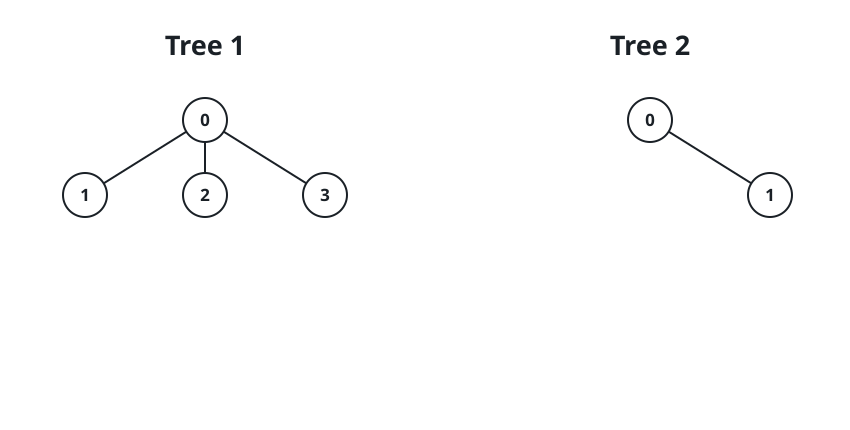
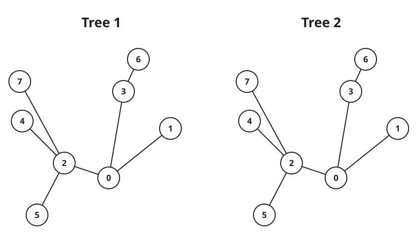

# The Tightest Joined Span

## Description

Two undirected trees are given: one on `n` nodes labeled `0` to `n - 1`,
one on `m` nodes labeled `0` to `m - 1`. Their edges arrive as the 2D
arrays `edges1` (with `n - 1` rows) and `edges2` (with `m - 1` rows),
where `edges1[i] = [ai, bi]` joins two nodes of the first tree and
`edges2[i] = [ui, vi]` joins two nodes of the second.

Choose one node from each tree and connect those two nodes with a single
new edge. Return the smallest span the joined tree can end up with.

The span of a tree is the length of its longest path — the largest count
of edges on any path between two of its nodes.

### Example 1



```text
Input: edges1 = [[0,1],[0,2],[0,3]], edges2 = [[0,1]]
Output: 3
Explanation: Bridging node 0 of the star to either end of the lone edge
leaves a longest path of length 3.
```

### Example 2



```text
Input: edges1 = [[0,1],[0,2],[0,3],[2,4],[2,5],[3,6],[2,7]], edges2 = [[0,1],[0,2],[0,3],[2,4],[2,5],[3,6],[2,7]]
Output: 5
Explanation: The two trees are the same shape, each with span 4, and
joining node 0 of one to node 0 of the other leaves a longest path of
length 5.
```

### Example 3

```text
Input: edges1 = [[0,1],[1,2]], edges2 = [[0,1]]
Output: 3
Explanation: Attaching the middle of the three-node path to either end
of the edge makes the longest path run from a path end, across the new
edge, to the far end of the second tree — 3 edges in all.
```

### Constraints

- `1 <= n, m <= 10⁵`
- `edges1.length == n - 1`
- `edges2.length == m - 1`
- `edges1[i].length == edges2[i].length == 2`
- `edges1[i] = [ai, bi]` with `0 <= ai, bi < n`
- `edges2[i] = [ui, vi]` with `0 <= ui, vi < m`
- Both edge lists are guaranteed to form valid trees.

## Hints

### Hint 1

Pin the bridge endpoints `a` and `b`. The joined span is the largest of
three lengths: the first tree's own longest path, the second tree's own
longest path, and the farthest reach from `a` inside tree 1 plus the
farthest reach from `b` inside tree 2 plus 1 for the bridge itself.

### Hint 2

The first two lengths never change; only the crossing term depends on
the choice of `a` and `b`, so the task reduces to making the two reaches
as small as possible.

### Hint 3

The smallest farthest-reach any node can have is `ceil(span / 2)`, and
the nodes achieving it sit in the middle of a longest path.

### Hint 4

Join the two middles: the answer is
`max(d1, d2, ceil(d1 / 2) + ceil(d2 / 2) + 1)`, with each span found by
the classic double-sweep.
