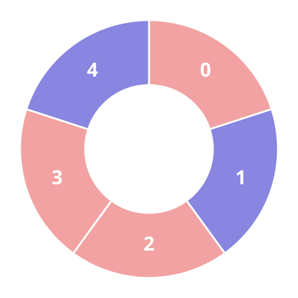
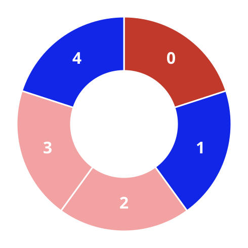
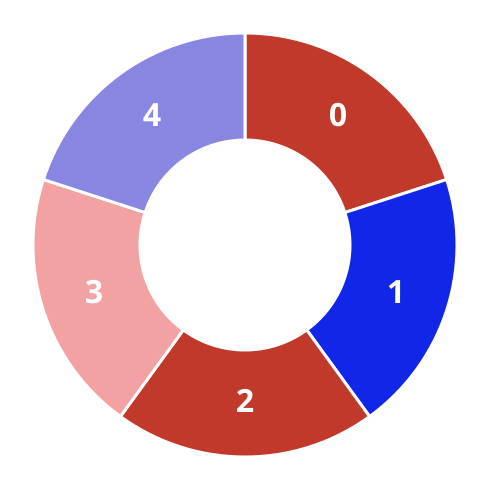

# Alternating Trios On A Circle I

## Description

A ring is tiled with red and blue tiles, described by the integer array
`colors`: tile `i` is red when `colors[i] == 0` and blue when
`colors[i] == 1`.

Any three neighboring tiles of the ring whose colors alternate — the
middle tile colored differently from both the tile on its left and the
tile on its right — form an alternating trio. Count the alternating
trios of the ring.

Because the tiles form a circle, the first and the last entries of
`colors` sit next to each other.

### Example 1


```text
Input: colors = [1,1,1]
Output: 0
Explanation: Every tile is blue, so no tile can differ from both of its
neighbors.
```

### Example 2








```text
Input: colors = [0,1,0,0,1]
Output: 3
Explanation: The alternating trios are the ones centered on the first
two tiles and on the last tile.
```

### Example 3

```text
Input: colors = [1,0,1,0]
Output: 4
Explanation: The colors alternate all the way around the ring, so every
tile sits at the center of one trio.
```

### Constraints

- `3 <= colors.length <= 100`
- `0 <= colors[i] <= 1`

## Hints

### Hint 1

Each tile is the middle of exactly one trio. Test every tile: its two
circular neighbors must both carry the opposite color.
