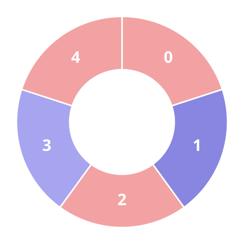
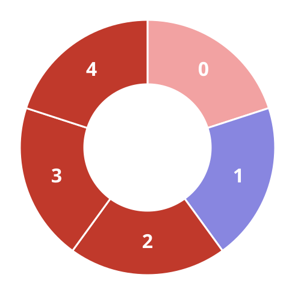
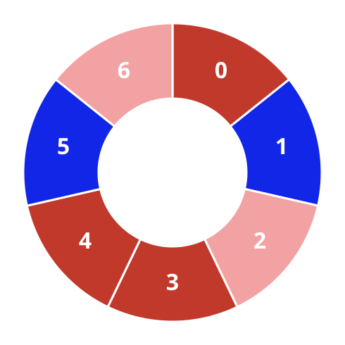

# Alternating Trios On A Circle II

## Description

A ring of tiles is painted in two shades. You are given an integer array
`colors` and an integer `k`, where `colors[i]` is the shade of tile `i`:

- `colors[i] == 0` marks the first shade.
- `colors[i] == 1` marks the second shade.

A stretch of `k` consecutive tiles is an alternating trio when every pair of
neighboring tiles inside it mixes the two shades — put differently, each
tile of the stretch other than the two ends differs from the tile on either
side.

Count the alternating trios of the ring.

The tiles form a circle, so the last tile neighbors the first one and a
stretch may run across that seam.

### Example 1







```text
Input: colors = [0,1,0,1,0], k = 3
Output: 3
```

Exactly three length-3 stretches alternate; the figures walk through them.

### Example 2




```text
Input: colors = [0,1,0,0,1,0,1], k = 6
Output: 2
```

Two length-6 stretches alternate; the figures walk through them.

### Example 3


```text
Input: colors = [1,1,0,1], k = 4
Output: 0
```

Every length-4 stretch here contains two equal neighbors, so nothing is
counted.

### Constraints

- `3 <= colors.length <= 10⁵`
- `colors[i]` is `0` or `1`.
- `3 <= k <= colors.length`

## Hints

### Hint 1

Scan for a spot where two adjacent tiles share a shade — that seam restarts
the alternation, so the longest trios begin right after it.

### Hint 2

From such a spot, one loop around the circle can extend alternating
stretches and tally every window that reaches length `k`.
