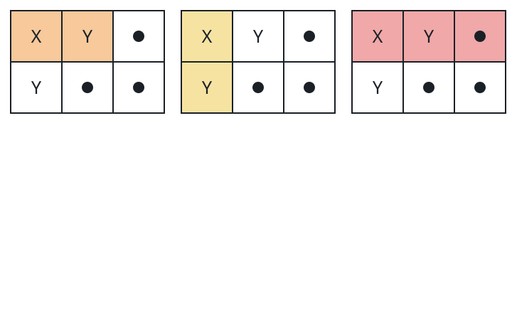

# Balanced Corner Rectangles

## Description

You are given a character matrix `grid`, whose every cell holds `'X'`,
`'Y'`, or `'.'`. Count the rectangles of `grid` that satisfy all three of:

- they include the top-left cell `grid[0][0]`;
- they hold the same number of `'X'` cells as `'Y'` cells;
- they hold at least one `'X'`.

### Example 1



```text
Input: grid = [["X","Y","."],["Y",".","."]]
Output: 3
```

### Example 2

```text
Input: grid = [["X",".","Y"],[".","X","Y"]]
Output: 2
```

Two anchored stretches balance: the entire top row (one `'X'`, one `'Y'`)
and the whole grid (two `'X'` cells against two `'Y'` cells).

### Example 3

```text
Input: grid = [["Y","X"],[".","Y"],["X","."]]
Output: 3
```

The balanced ones are the top row, the left column, and the whole grid —
holding one `'X'` against one `'Y'`, one against one, and two against
two, respectively.

### Constraints

- `1 <= grid.length, grid[i].length <= 1000`
- `grid[i][j]` is `'X'`, `'Y'`, or `'.'`.

## Hints

### Hint 1

Score `'X'` as `+1`, `'Y'` as `-1`, and `'.'` as `0`; equal counts of
`'X'` and `'Y'` become a score of zero.

### Hint 2

Requiring `grid[0][0]` means a rectangle is decided by its bottom-right
cell alone: it is always the stretch of rows `0..r` and columns `0..c`.

### Hint 3

Prefix sums let you fold each cell into a running rectangle score and a
running `'X'` count; a cell contributes an answer when its score is zero
and its `'X'` count is positive.
