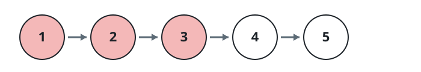
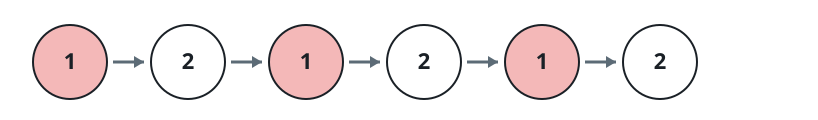
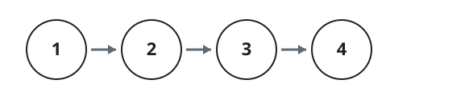

# Pruning Listed Values Off A Linked List

## Description

You are given the `head` of a linked list together with an integer array
`nums`. Detach every node whose value appears in `nums`, keeping the
surviving nodes in their original order, and return the head of the
remaining list.

### Example 1



```text
Input: nums = [1,2,3], head = [1,2,3,4,5]
Output: [4,5]
Explanation: The first three nodes all carry values named in `nums`, so
the surviving chain begins at 4.
```

### Example 2



```text
Input: nums = [1], head = [1,2,1,2,1,2]
Output: [2,2,2]
Explanation: Every 1 is flagged for removal; the three 2s survive and end
up directly adjacent.
```

### Example 3



```text
Input: nums = [5], head = [1,2,3,4]
Output: [1,2,3,4]
Explanation: The value 5 never occurs on the list, so nothing is detached.
```

### Constraints

- `1 <= nums.length <= 10⁵`
- `1 <= nums[i] <= 10⁵`
- All elements of `nums` are distinct.
- The list contains between `1` and `10⁵` nodes.
- `1 <= Node.val <= 10⁵`
- The input is arranged so that at least one node of the list holds a
  value absent from `nums`.

## Hints

### Hint 1

Drop every entry of `nums` into a hash set so that asking "is this value
flagged?" costs constant time.

### Hint 2

Sweep the chain once from a dummy node in front of the head, unlinking
each successor the set contains.
