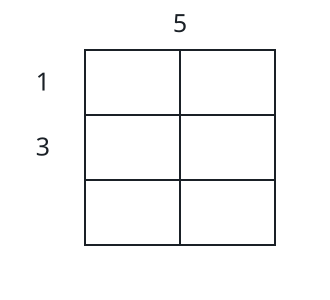

# Dicing A Cake At Least Cost II

## Description

A cake in the shape of an `m x n` grid has to be reduced entirely to
`1 x 1` pieces. Two arrays of tolls are given:

- `horizontalCut` has length `m - 1`; `horizontalCut[i]` is the toll for
  cutting along horizontal line `i`.
- `verticalCut` has length `n - 1`; `verticalCut[j]` is the toll for
  cutting along vertical line `j`.

One operation picks a piece that is not yet `1 x 1` and cuts it along one
of its internal lines, paying that line's toll and splitting the piece in
two. The toll depends only on the line itself and never changes, so a
line that still spans several pieces is paid once per piece that gets cut
along it.

Return the smallest total toll that reduces the whole cake to `1 x 1`
pieces.

### Example 1



```text
Input: m = 3, n = 2, horizontalCut = [1,3], verticalCut = [5]
Output: 13
Explanation: Start with the vertical line, paying 5 and splitting the
cake into two 3 x 1 columns. Both horizontal lines must then be cut in
each column, and each of those four cuts pays its line's toll — 1 + 1 +
3 + 3 — for a total of 5 + 1 + 1 + 3 + 3 = 13.
```

### Example 2

```text
Input: m = 2, n = 3, horizontalCut = [6], verticalCut = [5, 2]
Output: 20
Explanation: Take the horizontal cut first, while the cake still spans a
single row strip — that costs 6. Each vertical line then has to be cut in
both row strips, so each is paid twice: 2 * 5 + 2 * 2. The grand total is
6 + 10 + 4 = 20.
```

### Constraints

- `1 <= m, n <= 10⁵`
- `horizontalCut.length == m - 1`
- `verticalCut.length == n - 1`
- `1 <= horizontalCut[i], verticalCut[i] <= 10³`

## Hints

### Hint 1

Work out what multiplier each toll ends up carrying — a line's toll is
charged once for every piece that still spans it when that piece is cut.

### Hint 2

Take a schedule and examine two adjacent operations of different
families; compute how the pair's combined cost changes when the two are
swapped.

### Hint 3

That swap test never gets worse when the pricier line goes first, so an
optimal schedule processes the lines in descending order of toll —
merging both families into one sorted order.
