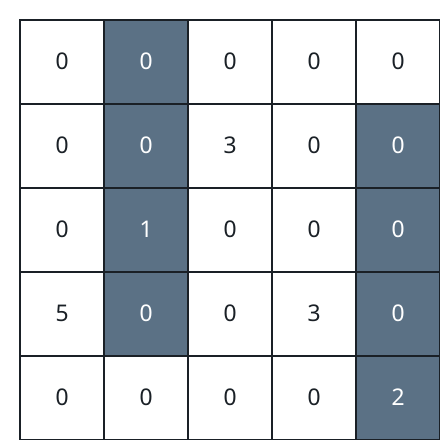
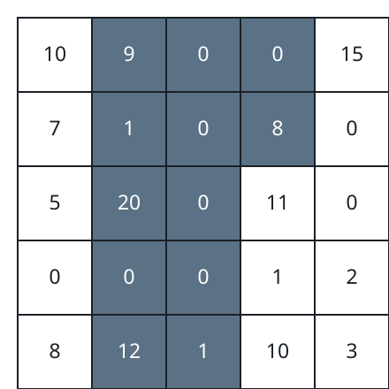

# White Neighbors Of Painted Columns

## Description

An `n x n` matrix `grid` is given; every cell starts white. One move
picks a column `j` and a cutoff row `i`, then paints black every cell
of column `j` from the top of the grid down through row `i` — the top
`i + 1` cells of that column.

After any sequence of moves, the board earns a score: the sum of
`grid[i][j]` over every cell that is still white and touches a black
cell horizontally (the cell immediately to its left or right is
black). Vertically adjacent black cells contribute nothing.

Return the largest score any sequence of moves can reach.

### Example 1



```text
Input: grid = [[0,0,0,0,0],[0,0,3,0,0],[0,1,0,0,0],[5,0,0,3,0],[0,0,0,0,2]]
Output: 11
Explanation: Paint column 1 through row 3, then column 4 through the
bottom row. Three white cells end up beside black ones — grid[3][0],
grid[1][2] and grid[3][3] — worth 5 + 3 + 3, so the board scores 11.
```

### Example 2



```text
Input: grid = [[10,9,0,0,15],[7,1,0,8,0],[5,20,0,11,0],[0,0,0,1,2],[8,12,1,10,3]]
Output: 94
Explanation: Paint columns 1, 2 and 3 down through rows 1, 4 and 0
respectively. The white cells flanking those black stretches —
grid[0][0], grid[1][0], grid[2][1], grid[4][1], grid[1][3], grid[2][3],
grid[3][3], grid[4][3] and grid[0][4] — add up to 94.
```

### Example 3

```text
Input: grid = [[4,0,6],[0,7,0],[2,0,9]]
Output: 21
Explanation: Paint the whole middle column. Every other cell is now
white with a black neighbor: the left column offers 4 + 0 + 2 and the
right column 6 + 0 + 9, a total of 21 that no other painting beats.
```

### Constraints

- `1 <= n == grid.length <= 100`
- `n == grid[i].length`
- `0 <= grid[i][j] <= 10⁹`

## Hints

### Hint 1

A final board is fully described by one height per column — how far
down that column is black — so think of the moves as choosing `h[j]`
between `0` and `n` for every column.

### Hint 2

Cell `(i, j)` scores exactly when it sits at or below its own column's
height and above at least one neighboring column's height, so column
`j` is worth the sum of its column-values over the row window
`[h[j], max(h[j-1], h[j+1]))`. Prefix sums turn each such window into
a difference of two sums.

### Hint 3

Sweep the columns left to right with a dynamic program over the last
two chosen heights; deciding the next height fixes the middle
column's flanks and credits it exactly once. Summing `max(h[j-1],
h[j+1])` naively gives `O(n⁴)`; keeping one boolean — whether column
`j - 2` is taller than column `j` — trims it to `O(n³)`.
