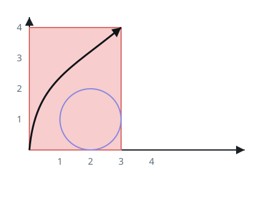
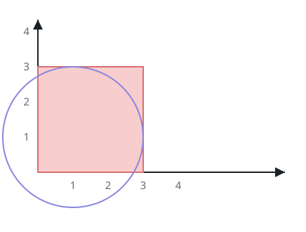
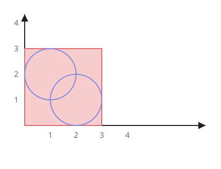
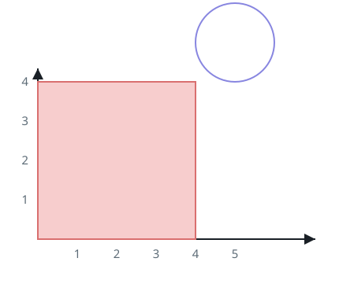

# Corner To Corner Past The Circles

## Description

You are given two positive integers `xCorner` and `yCorner`, and an array
`circles`, where `circles[i] = [xi, yi, ri]` describes a circle centered at
`(xi, yi)` with radius `ri`.

A rectangle sits in the plane with its lower-left corner at the origin and
its upper-right corner at `(xCorner, yCorner)`. Decide whether some route
from the lower-left corner to the upper-right corner exists that stays
inside the rectangle, never enters or even grazes any circle, and meets the
rectangle's boundary nowhere except at those two corner endpoints.

Return `true` when such a route exists, and `false` otherwise.

### Example 1



```text
Input: xCorner = 3, yCorner = 4, circles = [[2,1,1]]
Output: true
Explanation: The black curve sketches one workable route from (0, 0) to
(3, 4).
```

### Example 2



```text
Input: xCorner = 3, yCorner = 3, circles = [[1,1,2]]
Output: false
Explanation: Nothing can get from (0, 0) to (3, 3) here.
```

### Example 3



```text
Input: xCorner = 3, yCorner = 3, circles = [[2,1,1],[1,2,1]]
Output: false
Explanation: The two circles touch each other and together reach all four
sides, forming a connected wall the route cannot cross.
```

### Example 4



```text
Input: xCorner = 4, yCorner = 4, circles = [[5,5,1]]
Output: true
```

### Constraints

- `3 <= xCorner, yCorner <= 10⁹`
- `1 <= circles.length <= 1000`
- `circles[i].length == 3`
- `1 <= xi, yi, ri <= 10⁹`

## Hints

### Hint 1

Build a graph whose nodes are the circles plus the rectangle's four sides.

### Hint 2

Join two circle nodes when the circles overlap or touch; join a circle node
to a side node when the circle reaches that side's segment.

### Hint 3

All comparisons can be made with squared distances between integer
coordinates, so tangency is decided exactly.

### Hint 4

The route fails to exist exactly when one of the pairs left-right,
left-bottom, right-top, or top-bottom ends up joined in that graph.
