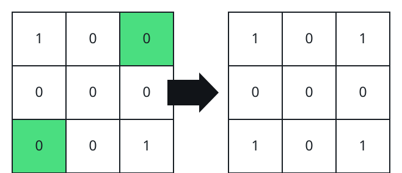
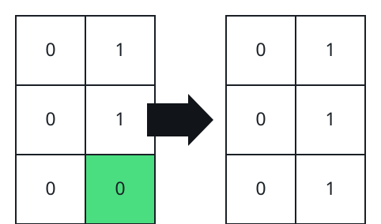

# Straightening Grid Lines by Flipping Cells I

## Description

You are given an `m x n` binary grid.

Call one row or one column of the grid a line. A line is straight when its
cells read the same scanning from either end toward the middle.

Any number of times, you may pick a cell of the grid and flip its bit —
`0` becomes `1`, or `1` becomes `0`.

Return the minimum number of flips needed so that either every row is
straight or every column is straight. You fix one direction only; the other
direction is left as it is.

### Example 1



```text
Input: grid = [[1,0,0],[0,0,0],[0,0,1]]
Output: 2
Explanation: Turning the two marked cells makes every row read the same
from both ends.
```

### Example 2



```text
Input: grid = [[0,1],[0,1],[0,0]]
Output: 1
Explanation: One flip on the marked cell straightens every column.
```

### Example 3

```text
Input: grid = [[0,0,1],[1,0,1],[1,1,1]]
Output: 1
Explanation: Only the top row holds a mirrored pair with two different
bits, so a single flip straightens all three rows.
```

### Example 4

```text
Input: grid = [[1,0,1,0],[0,1,0,1]]
Output: 4
Explanation: Here neither direction is cheap: four flips are needed no
matter whether you straighten the rows or the columns.
```

### Constraints

- `m == grid.length`
- `n == grid[i].length`
- `1 <= m * n <= 2 * 10⁵`
- `grid[i][j]` is `0` or `1`.

## Hints

### Hint 1

Within one row, the work breaks into independent mirrored pairs
`(row[j], row[n - 1 - j])`. A pair holding two different bits needs exactly
one flip to agree; a pair that already agrees is cheapest untouched, and the
middle cell of an odd-length row matches itself.

### Hint 2

Rows never influence one another, so the row total is just the number of
disagreeing pairs summed over all rows. Run the same count down the columns
and answer with whichever total is smaller.
