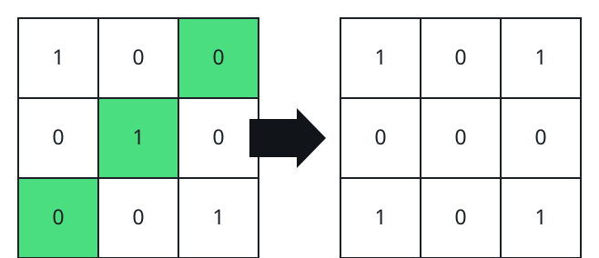

# Straightening Grid Lines by Flipping Cells II

## Description

You are given an `m x n` binary grid. As before, a line — one row or one
column — is straight when its cells read the same scanning from either end
toward the middle, and a move flips a single cell's bit, `0` to `1` or `1`
to `0`.

This time the demand is stricter: every row and every column must be
straight at the same time, and on top of that the total number of `1`s left
in the grid must be divisible by `4`.

Return the minimum number of flips that meets all three requirements.

### Example 1



```text
Input: grid = [[1,0,0],[0,1,0],[0,0,1]]
Output: 3
Explanation: Two flips settle the four corner cells to one common bit, and
a third clears the center so the remaining count of 1s stays a multiple of
four.
```

### Example 2


```text
Input: grid = [[0,1],[0,1],[0,0]]
Output: 2
Explanation: The middle column's two 1s already agree, but two is not a
multiple of four, so the cheapest fix flips that pair together — two moves
— which zeroes the grid's 1-count.
```

### Example 3


```text
Input: grid = [[1],[1]]
Output: 2
Explanation: The lone pair of cells is already equal, yet holding two 1s
breaks the divisibility rule, so both cells flip.
```

### Example 4

```text
Input: grid = [[1,1,1],[1,1,0],[1,0,0]]
Output: 4
Explanation: One flip each settles the corner quadruple, the middle-row
pair, and the middle-column pair, and clearing the center spends the fourth
flip while keeping the 1-count divisible by four.
```

### Constraints

- `m == grid.length`
- `n == grid[i].length`
- `1 <= m * n <= 2 * 10⁵`
- `grid[i][j]` is `0` or `1`.

## Hints

### Hint 1

Reflect any cell across the horizontal and vertical midlines: for
`(x, y)` the partners `(m - 1 - x, y)`, `(m - 1 - x, n - 1 - y)`, and
`(x, n - 1 - y)` must all end up with the same bit, because every row and
every column is straight at once.

### Hint 2

Odd dimensions leave a middle row or middle column of simple mirror pairs,
and two odd dimensions leave a lone center cell. Those small orbits are
exactly what the divisible-by-4 rule constrains — check how many pairs each
state leaves holding `1`s.
