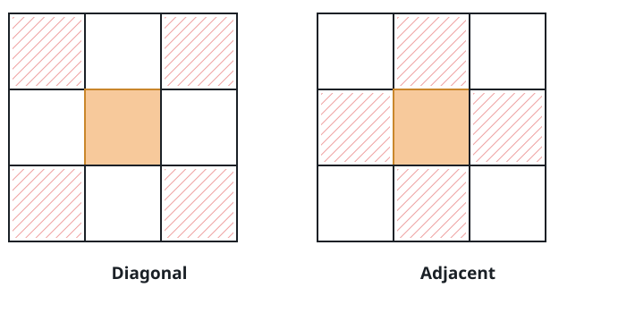
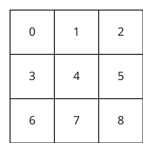
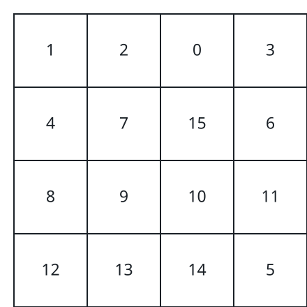

# Neighbor Sums On A Numbered Grid

## Description

You are given an `n x n` grid whose cells hold the distinct values `0` to
`n² - 1` in some arrangement. A small service sits on top of the grid and
answers questions of one shape: for a given value, how much do its
surrounding cells add up to?

Implement the `NeighborTotals` class:

- `NeighborTotals(int[][] grid)` initializes the service with the grid.
- `int sideSum(int value)` returns the sum of `value`'s four side
  neighbors — the cells directly above, below, left, and right of it in
  `grid`.
- `int cornerSum(int value)` returns the sum of `value`'s four corner
  neighbors — the cells diagonally adjacent to it in `grid`.

Neighbors that would fall outside the grid simply do not exist and
contribute nothing.



### Example 1



```text
Input:
["NeighborTotals", "sideSum", "sideSum", "cornerSum", "cornerSum"]
[[[[0, 1, 2], [3, 4, 5], [6, 7, 8]]], [1], [4], [4], [8]]
Output: [null, 6, 16, 16, 4]
Explanation:
The side neighbors of 1 are 0, 2, and 4.
The side neighbors of 4 are 1, 3, 5, and 7.
The corner neighbors of 4 are 0, 2, 6, and 8.
The only corner neighbor of 8 is 4.
```

### Example 2



```text
Input:
["NeighborTotals", "sideSum", "cornerSum"]
[[[[1, 2, 0, 3], [4, 7, 15, 6], [8, 9, 10, 11], [12, 13, 14, 5]]], [15], [9]]
Output: [null, 23, 45]
Explanation:
The side neighbors of 15 are 0, 10, 7, and 6.
The corner neighbors of 9 are 4, 12, 14, and 15.
```

### Constraints

- `3 <= n == grid.length == grid[0].length <= 10`
- Every cell value lies in `[0, n² - 1]`, and all values are distinct.
- Every `value` passed to `sideSum` or `cornerSum` lies in
  `[0, n² - 1]`.
- At most `2 * n²` calls in total are made to `sideSum` and `cornerSum`.

## Hints

### Hint 1

First work out where in the grid the queried value actually sits.

### Hint 2

Remembering each value's coordinates ahead of time lets every query be
answered with a fixed handful of lookups.
