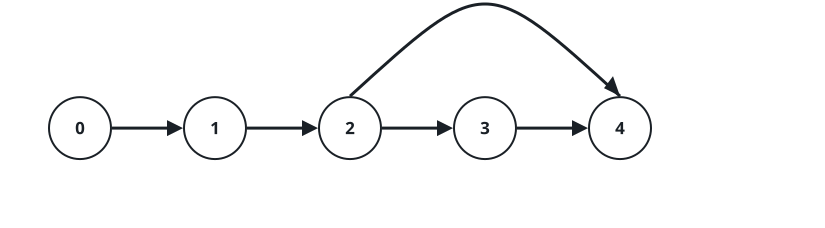
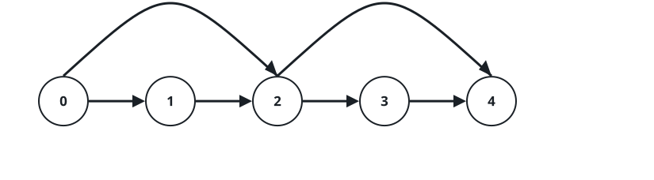
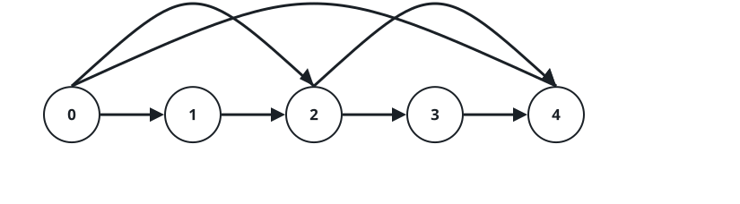
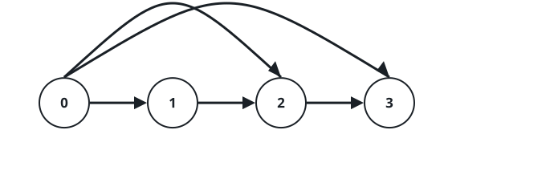

# Quickest Trip as Shortcuts Open I

## Description

The towns `0` through `n - 1` hang off a single one-way avenue: for every
`0 <= i < n - 1` a road leads straight from town `i` to town `i + 1`.

Shortcuts then start arriving. Each query `[u, v]` opens one additional
one-way road, from town `u` directly to town `v`, and every road opened
stays open.

After each new road, a courier re-measures the smallest number of roads
that carries her from town `0` to town `n - 1`. Return an array `answer`
in which `answer[i]` is that smallest count once the first `i + 1` queries
have opened their roads.

### Example 1







```text
Input: n = 5, queries = [[2,4],[0,2],[0,4]]
Output: [3,2,1]
Explanation: The first shortcut drops the trip to 3 roads, the second to
2, and the direct 0-to-4 road finishes the job at 1.
```

### Example 2




```text
Input: n = 4, queries = [[0,3],[0,2]]
Output: [1,1]
Explanation: The very first shortcut already joins the two ends, so the
second road changes nothing.
```

### Example 3

```text
Input: n = 6, queries = [[1,3],[0,4]]
Output: [4,2]
Explanation: Hopping 0 to 1, then straight to 3, leaves a trip of 4 roads;
once 0 reaches 4 directly, only the final hop to 5 remains.
```

### Constraints

- `3 <= n <= 500`
- `1 <= queries.length <= 500`
- `queries[i].length == 2`
- `0 <= queries[i][0] < queries[i][1] < n`
- `1 < queries[i][1] - queries[i][0]`
- No two queries open the same road.

## Hints

### Hint 1

`n` and the query count are small: keep the road set up to date and simply
recompute the town-`0`-to-town-`n - 1` shortest path after every insertion.

### Hint 2

A breadth-first layer walk over the current roads is exactly that
recomputation, and it is cheap enough to run once per query.
